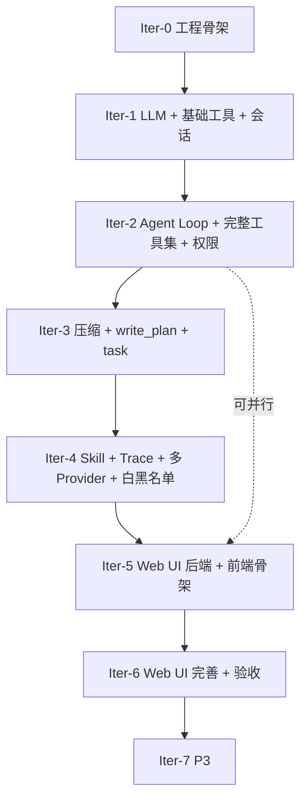

# mini-agent 开发计划

> 制定时间：2026-05-23
> 总周期：一周（Day 1–7）
> 阶段对齐：需求文档 `06-phasing.md` 的 P0/P1/P2/P3

本计划把需求文档中的阶段（P0–P3）分解为可执行的开发任务，每个任务给出：编号、内容、依赖、产出、DoD、所属模块。

---

## 1. 总体迭代节奏

| 迭代 | 时段 | 主线 | 关键里程碑 |
|---|---|---|---|
| **Iter-0** | Day 1 上午 | 工程骨架 | 项目可编译、CLI 可启动、配置可加载 |
| **Iter-1** | Day 1 下午–Day 2 | LLM + 基础工具 + 会话持久化 | 能跑一次最简对话并调用 read_file |
| **Iter-2** | Day 3 | Agent Loop + 完整工具集 + 权限模式 | 能完成一次完整编程任务（含审批） |
| **Iter-3** | Day 4 | 上下文压缩 + write_plan + task | 长会话不溢出，能用 todo 与子 agent |
| **Iter-4** | Day 5 | Skill + Trace + 多 Provider + 白黑名单 | 完整 P1 能力交付 |
| **Iter-5** | Day 6 | Web UI 后端 + 前端骨架 | 浏览器能看到会话并发消息 |
| **Iter-6** | Day 7 | Web UI 完善 + 联调 + 验收 | 全部 P0/P1/P2 验收通过 |
| **Iter-7** | 一周后 | P3：MCP / 多压缩策略 / 异步子 agent | 排期外 |

---

## 2. Iter-0 · 工程骨架（Day 1 上午）

| 任务编号 | 任务 | 依赖系统设计 | 产出 | DoD |
|---|---|---|---|---|
| T0.1 | 初始化 Go 模块、目录骨架（按 R1 目录结构创建空包，每个包加 `doc.go`） | R1 ✅ | `internal/*/doc.go` | `go build ./...` 通过 |
| T0.2 | 引入主依赖（cobra/viper/gin/slog/lumberjack/openai-go/anthropic-sdk-go/modernc.org/sqlite/sqlc/golang-migrate/google/uuid/invopop/jsonschema/pkoukk/tiktoken-go/mvdan.cc/sh/testify） | R1 + R5 + R7-1' ✅ | `go.mod` / `go.sum` | `go mod tidy` 干净 |
| T0.3 | Makefile 串起 build/test/run/migrate/sqlc generate/update-tool-goldens | R1 + R7-1' ✅ | `Makefile` | `make build` `make test` 通过 |
| T0.4 | 配置加载（viper）+ 默认配置文件路径 + `--config` 覆盖 | R4 + R5 ✅ | `internal/config/` | 启动时能从 `~/.mini-agent/config.yaml` 加载，参数可覆盖 |
| T0.5 | 日志封装（slog + lumberjack + 敏感字段过滤） | ⏳ 等 R12 | `internal/logs/` | 日志文件按配置路径输出，API Key 不出现在日志 |
| T0.6 | cobra root 命令 + `version` 子命令 | R1 ✅ | `cmd/mini-agent/main.go` `internal/cli/cmd/` | `mini-agent version` 输出版本号 |
| T0.7 | 前端工程骨架（pnpm + vite + ts + react + antd 起步页） | R1 ✅ | `web/` | `pnpm dev` 能跑出 antd 起步页 |

---

## 3. Iter-1 · LLM + 基础工具 + 会话持久化（Day 1 下午–Day 2）

| 任务编号 | 任务 | 依赖系统设计 | 产出 | DoD |
|---|---|---|---|---|
| T1.1 | 定义 trace 事件类型 | ⏳ 等 R12 | `internal/trace/` | 事件类型可被 agent/tool/permission 引用 |
| T1.2 | 定义 uio.Sink + uio.Prompter 接口 | R1 ✅ | `internal/uio/` | 接口空实现 + mock 通过 go vet |
| T1.3 | 定义 llm.Provider 接口 + 流式契约（含 ThinkingEffort / cache 字段 / StreamBlockBoundary） | R2 + R5 ✅ | `internal/llm/` | 单测覆盖 mock provider |
| T1.4 | 实现 OpenAI 兼容 provider（含流式 + function calling + usage + 思考模式 + 网络层重试 + pricing.go） | R5 ✅ | `internal/llm/openai/` | 单测注入假 LLM 服务可流式输出 |
| T1.5 | SQLite 迁移文件 + sqlc 配置 + Repository 实现（含 visibility / user_visibility / cache 三列） | R3 + R5 ✅ | `internal/session/` | `make migrate` 能建表；CRUD 单测通过 |
| T1.6 | 实现 read_file（详定）+ list_dir / grep / glob（按 R7-1' 模板填空） | R7-1' ✅ | `internal/tool/fs/` `internal/tool/search/` | 单测通过；read_file 通过 testkit 套件全部用例 + golden file |
| T1.7 | REPL 主循环 + 流式输出渲染（实现 uio.Sink） | ⏳ 等 R9 | `internal/cli/repl/` | 能对模型说一句话并看到流式回复 |
| T1.8 | bootstrap 第一版（拼装 Iter-1 所需模块） | R1 ✅ | `internal/bootstrap/` | `mini-agent` 启动后进入 REPL 可对话 |
| T1.9 | 端到端冒烟：让模型读取一个文件并总结 | — | 验收脚本 | 任务用例通过 |

---

## 4. Iter-2 · Agent Loop + 完整工具集 + 权限模式（Day 3）

| 任务编号 | 任务 | 依赖系统设计 | 产出 | DoD |
|---|---|---|---|---|
| T2.1 | 定义 tool.Tool / tool.Registry 接口（含启动期 schema 校验 D84） | R2 + R7-1' ✅ | `internal/tool/` | Registry 单测通过 |
| T2.2 | 定义 permission.Gate 接口 + 模式判定（默认/auto-edit/yes/plan） | R2 ✅ 接口；硬黑名单完整规则集留实现期细化 | `internal/permission/` | 模式 × 工具矩阵单测全绿 |
| T2.3 | 实现 write_file / edit_file（old_str 唯一约束 → ErrAmbiguous）/ delete_file 工具（按 R7-1' 模板填空） | R7-1' ✅ | `internal/tool/fs/` | 含审批冒烟用例；通过 testkit 套件 |
| T2.4 | 实现 bash 工具 + timeout + 硬黑名单 + shellwords 解析 + 复合命令拆解 | R7-1' ✅ 模板；命令解析与硬黑名单完整规则集实现期细化 | `internal/tool/shell/` | 硬黑名单单测 + timeout 测试 + ctx 取消（SIGKILL）通过 |
| T2.5 | 实现 ask_user 工具（通过 Prompter.AskUser；--yes 模式仍询问 D86） | R1 + R7-1' ✅ | `internal/tool/ask/` | REPL 模式下能与用户对话 |
| T2.6 | 实现 agent.Loop（ReAct 循环 + 步数上限 + 失败计数器 sync.Map+sha256 + 多 tool_calls 分桶并行 + 中断 tool_use↔tool_result 配对 + 跨 provider 切换归档思考块） | R6 ✅ | `internal/agent/` | 步数 / 重试 / 中断三项单测全绿 |
| T2.7 | REPL 斜杠命令派发（/help /exit /new /sessions /resume /clear /tools /cd /mode /cost /model /thinking /show-* 等）骨架 | ⏳ 等 R9 | `internal/cli/repl/` | 命令存在性测试通过 |
| T2.8 | AGENTS.md 加载与注入（`<project_guidelines>` 标签包裹 D52；UserVisibility=system D27）| R4 + R6 ✅ | `internal/agentsmd/` | 项目级 AGENTS.md 内容出现在系统提示词 |
| T2.9 | 端到端：在默认 / auto-edit / yes / plan 四种模式下分别完成一个标准任务 | — | 验收脚本 | 9.6 节验收项全绿 |

---

## 5. Iter-3 · 上下文压缩 + write_plan + task（Day 4）

| 任务编号 | 任务 | 依赖系统设计 | 产出 | DoD |
|---|---|---|---|---|
| T3.1 | 定义 compaction.Compactor 接口 + summarize 策略 | ⏳ 等 R8 | `internal/compaction/` | 长会话能被压缩到阈值以下 |
| T3.2 | 实现自动压缩触发（token 阈值） + `/compact` 手动命令 | ⏳ 等 R8 | `internal/agent/` `internal/cli/repl/` | 9.4 节验收项全绿 |
| T3.3 | 实现 write_plan 工具（全量覆盖语义） + Todo 仓储 | ⏳ 等 R7-2 | `internal/tool/plan/` `internal/session/` | `/todos` 能看到模型写入的 todo |
| T3.4 | 实现 task 工具（同步阻塞、嵌套深度 1、todo 互见、错误暴露；输出走 R6 D60 结构化模板） | R6 ✅ + ⏳ 等 R7-2 task input schema | `internal/tool/task/` `internal/agent/` | 9.3 节验收项全绿 |
| T3.5 | 端到端：让模型规划 → 子 agent 执行 → 主 agent 汇总 | — | 验收脚本 | 完整链路通过 |

---

## 6. Iter-4 · Skill + Trace + 多 Provider + 白黑名单（Day 5）

| 任务编号 | 任务 | 依赖系统设计 | 产出 | DoD |
|---|---|---|---|---|
| T4.1 | Skill 加载器：扫描两个查找位置 + 解析 SKILL.md | R2 ✅ | `internal/skill/` | 单测通过 |
| T4.2 | 启动时把所有 skill 的 name+description 注入系统提示词（R6 D54 第 2 条 system 消息） | R1 + R6 ✅ | `internal/agent/` | 系统提示词中可见 skill 列表 |
| T4.3 | 实现 skill_tool（加载指定 skill 的 SKILL.md 到上下文） | ⏳ 等 R7-2 | `internal/tool/skill/` | 模型调用后 SKILL.md 出现在对话上下文 |
| T4.4 | `/skill <name>` 斜杠命令 | ⏳ 等 R9 | `internal/cli/repl/` | 用户显式触发后 model 加载该 skill |
| T4.5 | 子 agent 继承父 agent 已加载的 skill | R6 ✅ | `internal/agent/` | 验收测试通过 |
| T4.6 | 压缩后重新注入 skill 列表 | ⏳ 等 R8 | `internal/compaction/` | `/compact` 后 skill 列表仍存在 |
| T4.7 | 详细 Trace 落地：LLM/工具/agent 决策/压缩/权限事件 | ⏳ 等 R12 | `internal/trace/` `internal/logs/` | 日志中五类事件齐全 |
| T4.8 | `/trace on/off` 切换 CLI 实时显示 | ⏳ 等 R9 | `internal/cli/repl/` | 切换有效 |
| T4.9 | 实现 Anthropic provider（P0）/ Gemini provider（P1）适配（按 R5 接口） | R5 ✅ | `internal/llm/anthropic/` `internal/llm/gemini/` | `/model` 能切换 |
| T4.10 | 命令级 / 路径级 / 工具级白黑名单（含跨 provider 切换归档思考块）| R4 + R6 ✅ | `internal/permission/` `internal/agent/model_switch.go` | 9.6 白黑名单验收项通过 |

---

## 7. Iter-5 · Web UI 后端 + 前端骨架（Day 6）

| 任务编号 | 任务 | 依赖系统设计 | 产出 | DoD |
|---|---|---|---|---|
| T5.1 | gin 路由 + REST API：会话 CRUD、消息发送、配置查询/更新 | ⏳ 等 R10 | `internal/webapi/handler/` | 用 curl 跑通基础 CRUD |
| T5.2 | SSE 流式接口：模型流式输出、工具调用事件、Trace 事件 | ⏳ 等 R10 | `internal/webapi/sse/` | 浏览器 EventSource 能收到事件 |
| T5.3 | 权限审批 SSE 推送 + REST 回执（实现 webapi 端 uio） | ⏳ 等 R10 | `internal/webapi/` | 审批端到端工作 |
| T5.4 | `mini-agent serve` 子命令 | R1 ✅ | `internal/cli/cmd/` | `serve --port 7777` 启动后端 |
| T5.5 | 前端：路由、布局、会话列表、消息流式显示（react + antd + zustand + react-query + axios） | ⏳ 等 R11 | `web/src/` | 浏览器能新建会话发消息看流式 |
| T5.6 | 前端：Markdown / 代码高亮（shiki）/ diff（react-diff-viewer-continued） | ⏳ 等 R11 | `web/src/components/` | 渲染正确 |

---

## 8. Iter-6 · Web UI 完善 + 联调 + 验收（Day 7）

| 任务编号 | 任务 | 依赖系统设计 | 产出 | DoD |
|---|---|---|---|---|
| T6.1 | 前端：工具调用可视化（折叠面板） | ⏳ 等 R11 | `web/src/components/` | 调用过程可见 |
| T6.2 | 前端：文件树侧边栏 + 文件预览 / diff | ⏳ 等 R10/R11 | `web/src/pages/` | 能浏览 cwd 下文件 |
| T6.3 | 前端：Todo 面板 + Trace 面板 + 配置编辑 | ⏳ 等 R11 | `web/src/pages/` | 三面板可用 |
| T6.4 | 前端：权限审批卡片（对话框内卡片，非弹窗） | ⏳ 等 R10/R11 | `web/src/components/` | 审批卡片样式合规 |
| T6.5 | 前端：Skill 详情查看面板 | ⏳ 等 R11 | `web/src/pages/` | 列出 skill 与查看预览 |
| T6.6 | 前端：多 cwd 切换 | ⏳ 等 R10/R11 | `web/src/` | 切换后会话上下文跟随 |
| T6.7 | 端到端验收：按 `09-acceptance.md` §9.1–9.12 全部跑一遍 | — | 验收报告 | 全部验收项通过 |

---

## 9. Iter-7 · P3（一周窗口外）

| 任务编号 | 任务 | 依赖系统设计 | 产出 |
|---|---|---|---|
| T7.1 | MCP Client（stdio/SSE/Streamable HTTP 三种传输） | ⏳ 等 R13 | `internal/mcp/`（视情况新增） |
| T7.2 | 滑动窗口式压缩策略 | ⏳ 等 R8 | `internal/compaction/` |
| T7.3 | 分层摘要式压缩策略 | ⏳ 等 R8 | `internal/compaction/` |
| T7.4 | 异步子 agent / Team 模式（如有需求再评估） | 重新走需求 | — |

---

## 10. 任务依赖图

> 串行优先：先把 CLI 通路彻底打通（Iter-0→Iter-4），再做 Web UI。Iter-5 与 Iter-3/Iter-4 在时间紧时可部分并行。

---

## 11. DoD（Definition of Done）通用准则

任何任务声明"完成"前必须满足：

1. **功能正确**：实现对应需求条款，且对应验收用例通过
2. **代码质量**：`go vet` + `staticcheck` + `gofmt` 无报错；前端 ESLint 无 error
3. **单测覆盖**：核心路径有单测；关键边界（错误、超时、中断）至少一个用例
4. **文档同步**：如该任务产生新约定、新错误码、新事件类型，更新对应 system-design 文档
5. **进度更新**：在 `02-progress.md` 中标记完成，记录实际产出文件与验收项对应

---

## 12. 风险登记（Risk Log）

| 风险编号 | 描述 | 影响 | 缓解策略 |
|---|---|---|---|
| R-1 | DeepSeek-V4-Pro 流式 + function calling 兼容性 | Iter-1 受阻 | Iter-0 末做兼容性 spike，必要时回退到非流式 |
| R-2 | 上下文压缩策略效果不达预期，会话仍溢出 | Iter-3 完不成 | 先实现 sliding-window 兜底，summarize 失败时退化 |
| R-3 | 一周时间内 P0+P1+P2 全部交付压力大 | 验收风险 | Web UI 优先做 P0 必备的 5 项面板（会话/消息流/工具调用/审批/skill），其他延后 |
| R-4 | sqlc 生成代码与迁移文件不匹配导致编译失败 | 反复 | 在 CI / Makefile 中强制 `sqlc generate` 必须与代码同步提交 |
| R-5 | UIO 抽象在两端实现不对齐导致行为不一致 | 用户体验差 | 编写共享单测套件，CLI 与 webapi 同时跑同一组用例 |
| R-6 | 系统设计 R2–R14 未及时锁定阻塞开发 | 进度滞后 | 每锁定一轮立即回填本计划；阻塞超过半天向用户通报 |

---

## 13. 文档与代码的同步纪律

- 系统设计每锁定一轮 → 回填本计划中"⏳等待设计"的任务详情
- 实现过程中如发现设计不可行 → 暂停任务，回到对应设计文档讨论修改 → 用户拍板后再恢复
- 实现过程中如发现需求不清 → 暂停任务，回到需求文档走"同意需求分析结论"流程

---

## 14. 后续待回填项

下列任务详情依赖尚未锁定的系统设计轮次。每锁定一轮即回填一次：

| 等待轮次 | 受影响任务 | 优先级 |
|---|---|---|
| ~~R5（LLM Provider 适配）~~ | ~~T1.4 / T4.9~~ | ✅ 已锁定（D32–D48）|
| ~~R6（Agent Loop）~~ | ~~T2.6 / T3.4 / T4.5~~ | ✅ 已锁定（D49–D67）|
| ~~R7-1'（工具实现模板 + read_file）~~ | ~~T1.6 / T2.3 / T2.4~~ | ✅ 已锁定（D68–D86）|
| **R7-2**（P1 工具 schema：write_plan / task / skill_tool / web_fetch / web_search）| T3.3 / T3.4 / T4.3 | 中（Iter-3 起需要）|
| **R8**（压缩算法）| T3.1 / T3.2 / T4.6 / T7.2 / T7.3 | 中（Iter-3 起需要）|
| **R9**（CLI 斜杠命令派发）| T1.7 / T2.7 / T4.4 / T4.8 | **高**（Iter-1 末 T1.7 即需要）|
| **R12**（Trace 日志格式）| T0.5 / T1.1 / T4.7 | **高**（Iter-0 末 T0.5 即需要）|
| **R10**（Web UI 后端 API）| T5.1 / T5.2 / T5.3 / T6.2 / T6.4 / T6.6 | 低（Iter-5 才需要）|
| **R11**（前端架构）| T5.5 / T5.6 / T6.1–T6.6 | 低（Iter-5 才需要）|
| **R13**（MCP Client）| T7.1 | 极低（一周窗口外）|

**触发节奏建议**：
- **R9** 与 **R12** 在 Iter-0 完成后立即触发（约 1 轮讨论各自）；不影响 Iter-0 前 4 个任务（T0.1–T0.3、T0.6）
- **R8** 与 **R7-2** 在 Iter-2 收尾时触发；不影响 Iter-1/2 主流程
- **R10/R11** 在 Iter-4 收尾时触发；不影响 Iter-1–4 主流程
- **R13** 仅当一周窗口内需要 MCP 时触发，否则直接进 Iter-7 排期
