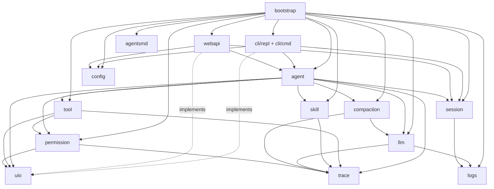

# 1. 总体架构

## 1.1 架构风格

**按功能模块平铺**（不分 domain / application / infrastructure 层）：

- 每个模块自己定义对外接口、自己写实现、自己管自己的数据类型
- 模块之间通过 import 直接调用
- 接口在**提供方自己的包内**定义（与 Java/C#/TypeScript 习惯一致）
- `internal/bootstrap` 是唯一可 import 所有模块的包，负责拼装

> 不引入 DDD 分层、不引入依赖注入框架（如 wire），保持代码"所见即所得"。

## 1.2 目录结构

```
mini-agent/
├── cmd/
│   └── mini-agent/
│       └── main.go                 # 进程入口
│
├── internal/
│   ├── agent/                      # ReAct loop + 子 agent 调度
│   │
│   ├── llm/                        # Provider 接口
│   │   ├── openai/                 # P0：DeepSeek 走这里（OpenAI 兼容协议）
│   │   ├── anthropic/              # P1
│   │   └── gemini/                 # P1
│   │
│   ├── tool/                       # Tool 接口 + Registry + 内置工具
│   │   ├── fs/                     # read_file / write_file / edit_file / list_dir / delete_file
│   │   ├── search/                 # grep / glob
│   │   ├── shell/                  # bash
│   │   ├── plan/                   # write_plan
│   │   ├── task/                   # task（子 agent 派发）
│   │   ├── skill/                  # skill_tool
│   │   ├── ask/                    # ask_user
│   │   └── web/                    # web_fetch (P1) / web_search (P2)
│   │
│   ├── skill/                      # Skill 加载器（扫描 + SKILL.md 解析）
│   │
│   ├── session/                    # Session / Message / Todo 仓储
│   │   ├── store/                  # sqlc 生成代码 + Repository 实现
│   │   └── migrations/             # SQL 迁移文件（go:embed）
│   │
│   ├── compaction/                 # Compactor 接口 + 三种策略
│   ├── permission/                 # 模式 + 白黑名单 + 硬黑名单
│   ├── trace/                      # Trace 事件类型
│   ├── logs/                       # slog 封装 + lumberjack 轮转 + 敏感字段过滤
│   ├── agentsmd/                   # AGENTS.md 加载与合并
│   ├── config/                     # viper 配置加载
│
│   ├── uio/                        # ★ Sink + Prompter 抽象（agent ↔ 用户交互）
│
│   ├── cli/
│   │   ├── repl/                   # REPL 主循环 + 斜杠命令派发；实现 uio.Sink/Prompter
│   │   └── cmd/                    # cobra 子命令（root / serve / migrate / version）
│   │
│   ├── webapi/                     # 实现 uio.Sink/Prompter（SSE + REST）
│   │   ├── handler/                # gin handler
│   │   ├── middleware/
│   │   └── sse/                    # SSE 流式推送
│   │
│   └── bootstrap/                  # 装配各模块（手写 DI）
│
├── web/                            # React + Vite + AntD 独立工程
│   ├── package.json
│   ├── vite.config.ts
│   ├── tsconfig.json
│   ├── src/
│   │   ├── main.tsx
│   │   ├── App.tsx
│   │   ├── routes/
│   │   ├── pages/
│   │   ├── components/             # 公共组件（消息气泡、工具卡、diff 等）
│   │   ├── stores/                 # zustand
│   │   ├── api/                    # axios + react-query hooks
│   │   ├── hooks/                  # useSSE 等
│   │   └── types/
│   └── public/
│
├── docs/
│   ├── requirements/
│   └── system-design/
│
├── scripts/
│   ├── migrate.sh
│   └── dev.sh
│
├── Makefile
├── sqlc.yaml
├── go.mod
├── go.sum
├── .gitignore
└── README.md
```

## 1.3 模块清单

| 模块 | 职责 | 主要外部依赖 |
|---|---|---|
| `cmd/mini-agent` | 进程入口，组装 cobra root | cobra |
| `internal/agent` | ReAct 循环、状态机、子 agent 调度、步数 / 重试计数 | 调用 llm / tool / compaction / permission / uio / skill / trace / session |
| `internal/llm` | Provider 接口 + 各 provider 适配 + 流式契约 + usage 提取 | openai-go 等 |
| `internal/tool` | Tool 接口、Registry、内置工具实现 | os / os/exec / ripgrep |
| `internal/skill` | 扫描查找路径、解析 SKILL.md、提供 skill 列表与内容 | os / yaml |
| `internal/session` | Session / Message / Todo 模型 + SQLite 仓储 | modernc/sqlite + sqlc |
| `internal/compaction` | Compactor 接口 + summarize / sliding / hierarchical 策略 | 调用 llm |
| `internal/permission` | 模式判定 + 白黑名单 + 硬黑名单 + 通过 uio 触发审批 | yaml |
| `internal/trace` | Trace 事件结构、span 关系 | 无（纯类型） |
| `internal/logs` | slog handler + lumberjack 轮转 + 敏感字段过滤 | slog / lumberjack |
| `internal/agentsmd` | AGENTS.md 查找与合并 | os |
| `internal/config` | viper 加载 + 字段定义 + 默认值 | viper |
| `internal/uio` | Sink + Prompter 接口（agent ↔ 用户交互抽象） | 无（纯接口） |
| `internal/cli/repl` | REPL 循环 + 斜杠命令派发；实现 uio 接口 | readline |
| `internal/cli/cmd` | cobra 子命令（root / serve / migrate / version） | cobra |
| `internal/webapi` | gin 路由 + handler + SSE 流；实现 uio 接口 | gin |
| `internal/bootstrap` | 手写 DI，装配各模块 | 所有 |

## 1.4 模块依赖图



虚线 `implements` 表示该模块实现 uio 包定义的接口。

## 1.5 依赖原则

1. **接口在提供方包内定义**：`llm.Provider` / `tool.Tool` / `compaction.Compactor` / `permission.Gate` / `skill.Loader` / `session.Repository` / `uio.Sink` / `uio.Prompter` 等都定义在各自的包内。
2. **避免循环依赖**：通过合理拆分模块保证。共用纯数据类型放在更基础的包中（例如 `trace` 不依赖业务包）。
3. **`bootstrap` 是唯一允许 import 所有模块的包**。
4. **CLI 与 webapi 不重复实现业务逻辑**：都通过调用 `agent` / `session` / `config` 等模块完成。
5. **`uio` 只声明接口，不实现**：实现由 `cli/repl` 与 `webapi` 提供，agent 等模块只感知接口。
