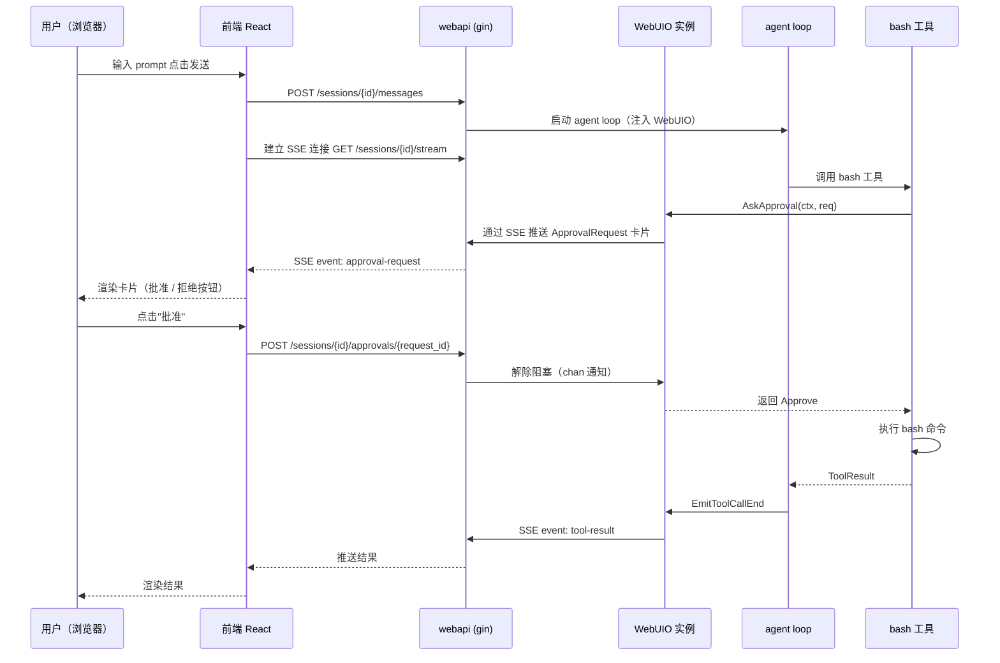
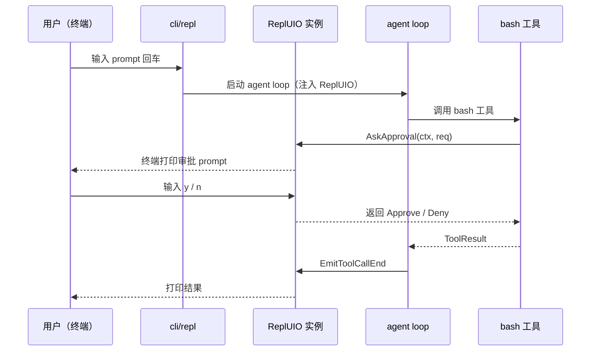

# 3. UIO 抽象 — Agent ↔ 用户交互通道

## 3.1 问题背景

mini-agent 在运行中需要与用户进行四类交互，必须在 CLI 与 Web UI 两种形态下行为一致：

| 场景 | 触发者 | 阻塞性 | 在 CLI 表现 | 在 Web UI 表现 |
|---|---|---|---|---|
| **A. 权限确认** | agent loop / tool 执行前 | 阻塞 | 终端 prompt | 对话框内卡片 |
| **B. 流式输出** | LLM stream | 非阻塞 | 实时 print | SSE 推送 |
| **C. 工具调用展示** | tool 执行前后 | 非阻塞 | 简短行 | 折叠面板 |
| **D. ask_user 主动提问** | 模型 function call | 阻塞 | 终端 prompt | 对话框内卡片 |

A/D 都是"阻塞等待用户答复"，本质同类。B/C 都是"单向输出"，本质同类。**必须形成统一抽象**，否则 agent 包会被 CLI/Web 双形态差异污染。

## 3.2 抽象方案

引入 `internal/uio` 模块，**只定义接口，不提供实现**。CLI 与 webapi 各自实现这些接口。

### 3.2.1 `Sink` 接口（单向输出，agent → 用户）

负责把 agent 内部事件单向推送给用户。CLI 实现把事件打印到终端；webapi 实现把事件序列化后通过 SSE 推送。

职责：
- 流式 token 推送
- 工具调用开始 / 结束事件
- 完整消息块
- 实时 trace 事件（按 `/trace` 开关决定是否输出）

### 3.2.2 `Prompter` 接口（双向请求，agent → 用户 → agent）

负责把 agent 的"请求型交互"递交给用户，并阻塞等待用户答复。

职责：
- **AskApproval**：权限确认（用户答 Approve / Deny / AlwaysApprove）
- **AskUser**：自由文本提问（用户答任意文本，对应 `ask_user` 工具）
- **AskChoice**：多选确认（从给定选项中选一个）

中断处理：
- 所有 `Prompter` 方法接受 `context.Context` 参数
- 用户中断（CLI Ctrl+C 或 webapi 关闭页面）通过 `ctx.Done()` 取消阻塞，方法返回错误
- 错误向上传播到 agent loop，触发需求文档 §2.2.4 中的"用户中断"终止条件

### 3.2.3 接口签名（草案）

> 注：本节为接口草案，**最终签名将在 R2 核心抽象轮次中定稿**。

```go
package uio

import "context"

// Sink 单向事件输出
type Sink interface {
    // EmitToken 推送一个 token 增量（流式输出）
    EmitToken(text string)

    // EmitToolCallStart 推送工具调用开始事件
    EmitToolCallStart(call ToolCallEvent)

    // EmitToolCallEnd 推送工具调用结束事件（含结果或错误）
    EmitToolCallEnd(call ToolCallEvent, result ToolResultEvent)

    // EmitMessage 推送完整消息块（非流式场景）
    EmitMessage(role Role, content string)

    // EmitTrace 推送实时 trace 事件（用户开关控制）
    EmitTrace(event TraceEvent)
}

// Prompter 双向请求
type Prompter interface {
    AskApproval(ctx context.Context, req ApprovalRequest) (ApprovalDecision, error)
    AskUser(ctx context.Context, req QuestionRequest) (string, error)
    AskChoice(ctx context.Context, req ChoiceRequest) (string, error)
}

// 类型定义（占位，R2 详定）
type Role string
type ToolCallEvent struct{ /* ... */ }
type ToolResultEvent struct{ /* ... */ }
type TraceEvent struct{ /* ... */ }
type ApprovalRequest struct{ /* ... */ }
type ApprovalDecision int
type QuestionRequest struct{ /* ... */ }
type ChoiceRequest struct{ /* ... */ }
```

## 3.3 实现位置

| 实现 | 位置 | 后端通道 |
|---|---|---|
| `ReplUIO` | `internal/cli/repl/` | 直接走终端：stdout 流式 print；stdin 用 readline 读取审批答复 |
| `WebUIO` | `internal/webapi/` | Sink 走 SSE 推送；Prompter 通过 SSE 推请求 + REST 接收回执 |

## 3.4 Web UI 卡片审批的端到端时序



## 3.5 CLI 审批的端到端时序



## 3.6 ask_user 工具的实现思路

> 详细工具签名留待 R7。

```
模型 → tool_call(ask_user, {"question": "你希望用哪个数据库？"})
  → agent loop 路由到 ask 工具
  → ask 工具调用 Prompter.AskUser(ctx, req)
  → 用户答 "SQLite"
  → 返回作为 tool_result 给模型
  → 模型继续推理
```

`ask_user` 工具在所有权限模式下都允许使用（包括 `--plan`），因为它不修改用户环境，只是问问题。

## 3.7 中断信号传递

```
用户 Ctrl+C
  → REPL 主循环 cancel 当前 agent ctx
  → ctx.Done() 触发
  → 正在阻塞的 Prompter 方法返回 ctx.Err()
  → tool 调用收到错误向上抛
  → agent loop 捕获并按"用户中断"分支终止
  → REPL 回到提示符等待下一轮输入
```

第二次 Ctrl+C 在 REPL 循环检测后退出进程。

## 3.8 与其他模块的协作约定

| 模块 | 与 uio 的关系 |
|---|---|
| `agent` | 接收 `uio.Sink` + `uio.Prompter` 作为依赖；通过 Sink 推流式事件，通过 Prompter 询问 |
| `permission` | 通过 `Prompter.AskApproval` 触发用户审批；不直接打印任何东西 |
| `tool/ask` | 通过 `Prompter.AskUser` 实现 ask_user 工具 |
| `tool/*` 其他 | 通过 `Sink.EmitToolCall*` 暴露执行进度（非阻塞） |
| `cli/repl` | 实现 `Sink` + `Prompter`，从 stdout/stdin 收发 |
| `webapi` | 实现 `Sink` + `Prompter`，从 SSE/REST 收发 |
| `trace` | 不直接依赖 uio；trace 事件由 agent / permission / tool 自己决定是否通过 `Sink.EmitTrace` 推送 |

## 3.9 留待后续轮次确定的细节

- `ToolCallEvent` / `ApprovalRequest` / `QuestionRequest` 等数据结构的具体字段（R2）
- SSE 事件名与 payload 格式（R10）
- 卡片在前端的具体组件设计（R11）
- Prompter 的超时策略（如用户始终不答怎么办）
