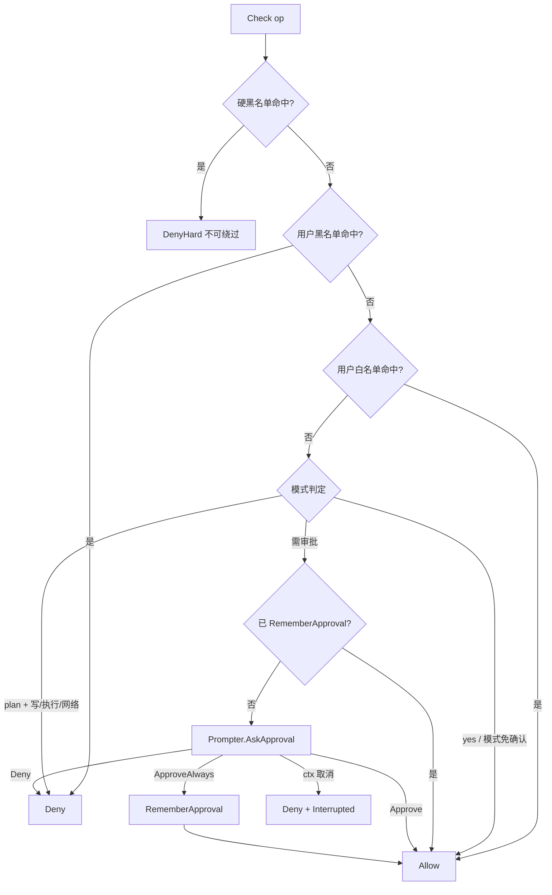
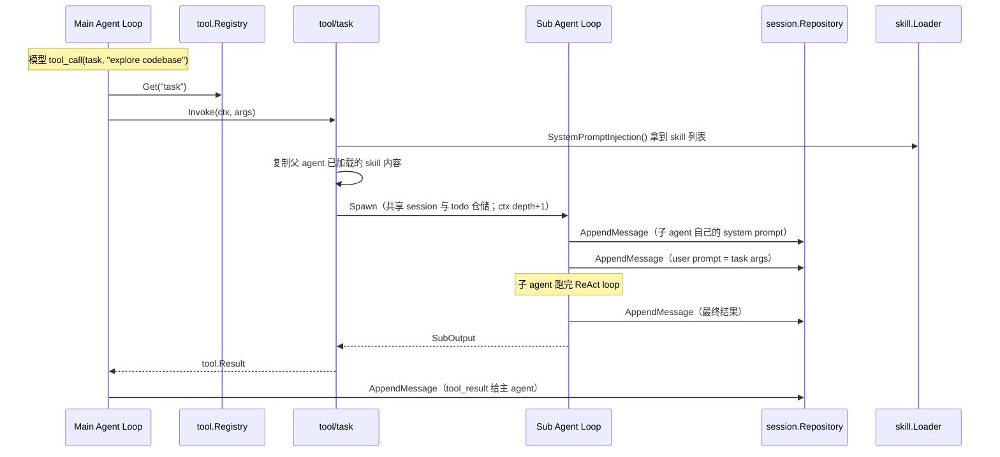
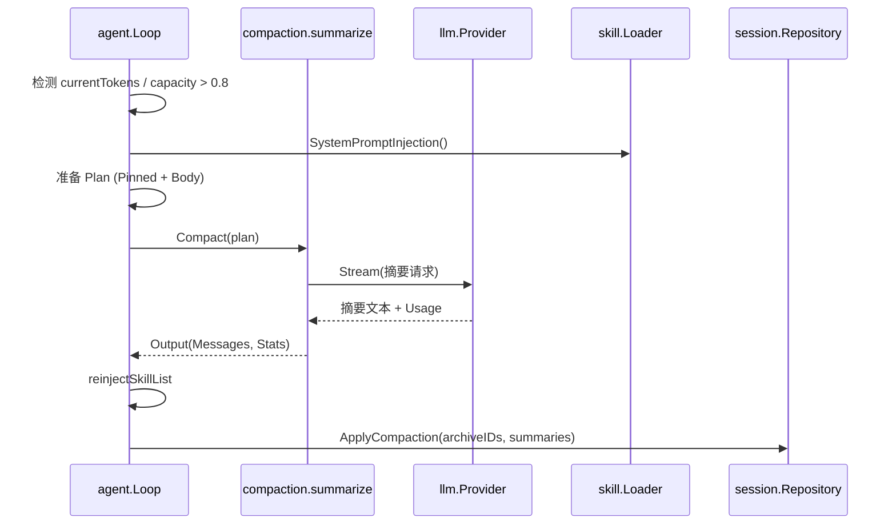

# 5. 核心抽象与领域模型（R2 + R3 + R4 + R5 + R6 + R7 修订）

> Status: ✅ R2 已锁定（2026-05-24） + R3 修订（2026-05-24）+ R4 指针约定补丁（2026-05-24）+ R5 字段扩充（2026-05-24）+ R6 §5.9 实化（2026-05-24）+ R7-1' 工具模板（2026-05-24）
> 范围：定义 9 个核心模块的对外接口、关键数据结构、协作约定
> 粒度：中粒度——含 interface 与关键结构体字段；不含错误码细节、SQL 字段、日志字段
> 后续配套：错误码 → R7-1' ✅；SQL 字段 → R3（见 `06-session-storage.md`）；日志字段 → R12；Provider 协议适配 → R5（见 `08-llm-providers.md`）；Agent 执行细节 → R6（见 `09-agent-engine.md`）；工具实现模板 → R7-1'（见 `10-tool-template-and-readfile.md`）；具体压缩算法 → R8
>
> **R3 修订点**（2026-05-24，本文档已就地更新）：
> - §5.1 trace：新增 `TypeLLMReasoningChunk` 事件类型（思考流）
> - §5.2 uio：`Sink` 新增 `EmitThinkingToken` 方法
> - §5.3 llm：`ContentBlock` 新增 `Thinking` / `RedactedThinking` 类型 + Signature 字段；`Delta` 新增 `Thinking` 字段；`Usage` 新增 `ReasoningTokens`；`Message.Content` 改为 `[]ContentBlock`（替代 string + ToolCalls + ToolCallID）
> - §5.7 compaction：Pinned/Body 划分新增规则——同一 assistant 消息内的 thinking + tool_use 不可拆开
> - §5.8 session：`Message` 字段重构（Blocks + SourceProvider + Visibility + UserVisibility）；Repository 接口替换 `ReplaceMessages` 为 `ListLiveMessages` / `ListVisibleMessages` / `ListAllMessages` / `ApplyCompaction`
> - §5.9 agent：`maybeCompact` 改用 `ApplyCompaction`；`prepareInitialHistory` 写入消息时显式设置 UserVisibility
>
> **R4 指针约定补丁（D31）**：本文档接口签名作为公开契约保留值参数，**实现阶段必须按 D31 风格落地**：① 所有结构体 receiver 用 `*T`；② 私有 helper 与批处理切片用指针；③ 接口（公开契约）方法参数保留值类型；④ 高频调用 + 小事件结构（如 uio Sink）保留值；⑤ 不对 slice/map/channel/func/interface/string/error 加 `*T`。详见 [`02-key-decisions.md`](02-key-decisions.md) D31。
>
> **R5 修订点**（2026-05-24，本文档已就地更新）：
> - §5.3 llm：`Request` 新增 `ThinkingEffort string`；`Usage` 新增三个 cache 字段（`CachedPromptTokens` / `CacheCreationTokens` / `CacheReadTokens`）；`StreamEventType` 新增 `StreamBlockBoundary`；`StreamEvent` 新增 `Boundary *BlockBoundary` 字段
> - 详见 [`08-llm-providers.md`](08-llm-providers.md) §8.4
>
> **R6 修订点**（2026-05-24）：§5.9 中 R6 留白全部填实，详见 [`09-agent-engine.md`](09-agent-engine.md)：
> - §5.9.4 ReAct 主流程：`msg.ToolCalls` 替换为 `extractToolUseBlocks(msg)`；多 tool_calls 走分桶并行执行（D58/D59，§9.6）
> - §5.9.5 单 tool_call：替换为 §9.6.2 完整版（含 D34 双轨：`ToolInput` 已是 `map[string]any`，无需 unmarshal）
> - §5.9.7 失败计数器：实化为 `*sync.Map` + signature 算法（D56/D57，§9.5）
> - §5.9.8 prepareInitialHistory：拼装 3 条独立 system 消息（D54，§9.4）；system 不持久化（D55）
> - §5.9.11 子 agent 派生：`SubOutput` 扩充字段；失败 / 半成功用结构化模板（D60/D61，§9.8）
> - §5.9.12 多 tool_calls 并行：从"默认串行"改为"按 Category 分桶并行"（D58）
> - 新增 §5.9.14 ctx 取消的最小颗粒度契约（D63，§9.10）
> - 新增 §5.9.15 中断时 tool_use ↔ tool_result 配对约束（D64，§9.7）
> - 新增 §5.9.16 跨 provider 切换 summary（D62，§9.9，与 §8.11.4 衔接）
>
> **R7-1' 修订点**（2026-05-24）：§5.4 tool 字段调整，详见 [`10-tool-template-and-readfile.md`](10-tool-template-and-readfile.md)：
> - `Result` 删除 `Truncated bool`，新增 `UserLimited bool` + `ForcedTruncated bool` 区分用户主动 limit vs 工具强制截断
> - `ErrorCode` 新增 `ErrTooLarge` / `ErrAmbiguous` 两个常量

---

## 5.0 模块全景与依赖

R2 覆盖以下 9 个模块（按依赖从底到顶组织）：

| 顺序 | 模块 | 在抽象体系中的角色 |
|---|---|---|
| 1 | `trace` | 最基础：所有可观测事件的载体类型 |
| 2 | `uio` | agent ↔ 用户交互的边界（已在 R1 锁定，本章给最终签名） |
| 3 | `llm` | 跨 Provider 的统一对话与流式契约 |
| 4 | `tool` | 工具调用契约（Tool 接口 + Registry） |
| 5 | `permission` | 权限决策（被 tool 调用前的统一判定） |
| 6 | `skill` | Skill 加载与系统提示词注入 |
| 7 | `compaction` | 上下文压缩接口与策略 |
| 8 | `session` | 会话 / 消息 / Todo 仓储接口 |
| 9 | `agent` | 上述所有抽象的消费方（loop + runner + spawner） |

接口定义遵循 R1 D4：**接口在提供方自己的包内定义**。

---

## 5.1 `internal/trace`

### 5.1.1 职责

为系统所有可观测事件提供统一的载体类型。`trace` 包**只定义类型**，不实现写入逻辑——写入由 `logs` 包通过 slog handler 完成（详见 R12）。

### 5.1.2 关键设计

- `Event` 结构体通过 `Type` 字段区分类型
- 三个 ID 字段表达父子关系：**TraceID（一次任务级别）+ SpanID（事件级别）+ ParentSpanID（父事件）**
- payload 用 `map[string]any`，由各模块自定义字段
- **不依赖任何业务模块**

### 5.1.3 接口与类型

```go
package trace

import (
    "context"
    "time"
)

type Type string

const (
    TypeLLMRequest        Type = "llm.request"
    TypeLLMResponse       Type = "llm.response"
    TypeLLMStreamChunk    Type = "llm.stream_chunk"
    TypeLLMReasoningChunk Type = "llm.reasoning_chunk"  // R3 新增：思考流事件
    TypeToolCallStart     Type = "tool.call_start"
    TypeToolCallEnd       Type = "tool.call_end"
    TypeAgentStep         Type = "agent.step"
    TypeAgentSubSpawn     Type = "agent.sub_spawn"
    TypeAgentSubReturn    Type = "agent.sub_return"
    TypeCompactStart      Type = "compaction.start"
    TypeCompactEnd        Type = "compaction.end"
    TypePermissionAsk     Type = "permission.ask"
    TypePermissionResult  Type = "permission.result"
    TypeSkillLoad         Type = "skill.load"
    TypeUserInterrupt     Type = "user.interrupt"
)

type Level int

const (
    LevelDebug Level = iota
    LevelInfo
    LevelWarn
    LevelError
)

type TraceID = string
type SpanID  = string

type Event struct {
    Type         Type
    Level        Level
    Time         time.Time
    TraceID      TraceID
    SpanID       SpanID
    ParentSpanID SpanID
    Message      string
    Fields       map[string]any
    Err          error
}

type Recorder interface {
    Record(ctx context.Context, e Event)
}

func WithTrace(ctx context.Context, traceID TraceID, parentSpanID SpanID) context.Context
func FromContext(ctx context.Context) (TraceID, SpanID, bool)
```

### 5.1.4 与其他模块的协作

| 模块 | 用法 |
|---|---|
| `agent` | 任务开始时生成 TraceID；每个 step / 子 agent 派生写 Event |
| `tool` | 每次 Invoke 前后写 ToolCallStart/End |
| `llm` | 每次请求 / chunk / 响应写事件，含 usage |
| `permission` | 每次 AskApproval 写 PermissionAsk + PermissionResult |
| `skill` | 每次加载 skill 写 SkillLoad |
| `compaction` | 压缩前后写 CompactStart / CompactEnd |
| `logs` | 实现 `Recorder`：把 Event 转 JSON Lines 落盘（敏感字段过滤） |

### 5.1.5 留待后续轮次

- 各事件类型的 Fields schema → R12
- TraceID/SpanID 生成策略 → R3
- JSON Lines 序列化格式 → R12

---

## 5.2 `internal/uio`

### 5.2.1 职责

R1 已锁定 UIO 是 agent ↔ 用户交互的统一抽象。本章给出**最终接口签名与关键数据结构**。

### 5.2.2 关键设计

- `Sink`（单向输出）和 `Prompter`（双向请求）拆成两个接口
- 同一个 CLI/Web 实例同时实现两个接口
- `Sink` 方法**不返回 error**——单向事件丢失不阻塞 agent
- `Prompter` 方法**都接 ctx**——支持中断
- `ApprovalDecision` 用 enum 表达三态：Approve / Deny / ApproveAlways

### 5.2.3 接口与类型

```go
package uio

import (
    "context"
    "time"
    "mini-agent/internal/trace"
)

type Role string

const (
    RoleUser      Role = "user"
    RoleAssistant Role = "assistant"
    RoleTool      Role = "tool"
    RoleSystem    Role = "system"
)

// ===== Sink：单向输出 =====

type Sink interface {
    EmitToken(text string)
    EmitThinkingToken(text string)  // R3 新增：思考增量（CLI 默认隐藏；Web UI 默认折叠）
    EmitToolCallStart(ev ToolCallStartEvent)
    EmitToolCallEnd(ev ToolCallEndEvent)
    EmitMessage(role Role, content string)
    EmitTrace(e trace.Event)
    EmitInfo(msg string)
    EmitError(err error)
}

type ToolCallStartEvent struct {
    CallID  string
    Name    string
    Args    map[string]any
    StartAt time.Time
}

type ToolCallEndEvent struct {
    CallID    string
    Name      string
    Succeeded bool
    Display   string
    Err       error
    Duration  time.Duration
}

// ===== Prompter：双向请求 =====

type Prompter interface {
    AskApproval(ctx context.Context, req ApprovalRequest) (ApprovalDecision, error)
    AskUser(ctx context.Context, req QuestionRequest) (string, error)
    AskChoice(ctx context.Context, req ChoiceRequest) (string, error)
}

type ApprovalRequest struct {
    ToolName    string
    Args        map[string]any
    Risk        RiskLevel
    Reason      string
    Description string
}

type RiskLevel int

const (
    RiskLow RiskLevel = iota
    RiskMedium
    RiskHigh
)

type ApprovalDecision int

const (
    DecisionDeny ApprovalDecision = iota
    DecisionApprove
    DecisionApproveAlways
)

type QuestionRequest struct {
    Question string
    Hint     string
}

type ChoiceRequest struct {
    Question string
    Options  []string
}
```

### 5.2.4 实现位置

| 实现 | 位置 | Sink 通道 | Prompter 通道 |
|---|---|---|---|
| `ReplUIO` | `internal/cli/repl/uio.go` | stdout 流式 print | stdin 用 `bufio` 读取 |
| `WebUIO` | `internal/webapi/uio.go` | SSE 推送 | SSE 推请求 + REST 回执 |

### 5.2.5 留待后续轮次

- SSE 事件 payload schema → R10
- "AlwaysApprove" 范围（会话内 / 进程内） → R7
- AskChoice 的 P0 实际使用情况 → 暂保留

---

## 5.3 `internal/llm`

### 5.3.1 职责

定义跨 Provider 的统一对话契约。具体协议适配（OpenAI / Anthropic / Gemini）放子包。

### 5.3.2 关键设计

- 流式契约采用 channel：`Stream(ctx, req) (<-chan StreamEvent, error)`
- Message 用 **Canonical ContentBlock 列表**表达（不是单一 string）——以 Anthropic 风格为蓝本，OpenAI 由 Provider 适配器降级转换
- 通过 ContentBlock.Type 区分文本 / 思考 / 工具调用 / 工具结果
- **Thinking 块的 Signature 字段对 Anthropic 必须保留并回传**——否则下一轮请求被拒
- `ToolSpec` 是工具描述的 LLM 视角；agent 把 `tool.Tool.Schema()` 转成 `ToolSpec`
- **Usage 必须由 Provider 从 response 提取**（需求 §2.1 禁止字符计数）；含独立的 `ReasoningTokens`
- Provider 接口最小化：只暴露 `Stream` + `Capabilities`；网络层重试 + 超时由 provider **自己实现**

### 5.3.3 接口与类型

```go
package llm

import "context"

type Provider interface {
    Name() string
    Capabilities() Capabilities
    Stream(ctx context.Context, req Request) (<-chan StreamEvent, error)
}

type Capabilities struct {
    Model              string
    ContextWindow      int
    MaxOutputTokens    int
    SupportsTools      bool
    SupportsStreaming  bool
    SupportsThinking   bool   // R3 新增：是否支持思考模式
}

type Request struct {
    Messages    []Message
    Tools       []ToolSpec
    ToolChoice  ToolChoice
    Temperature *float32
    MaxTokens   *int
    Stop        []string
    EnableThinking bool       // R3 新增：本次请求是否启用思考（部分 provider 需开启）
    ThinkingEffort string     // R5 新增："" | "low" | "medium" | "high"（各 provider 自行映射）
}

// Message 用 Canonical ContentBlock 列表表达
type Message struct {
    Role    Role
    Content []ContentBlock     // R3 修订：替代原 Content string + ToolCalls + ToolCallID
    Name    string
}

type Role string

const (
    RoleSystem    Role = "system"
    RoleUser      Role = "user"
    RoleAssistant Role = "assistant"
    RoleTool      Role = "tool"  // canonical 层尽量避免使用；推荐用 user + ToolResultBlock 表达
)

// ContentBlock 一段消息内容；Type 决定字段语义
type ContentBlock struct {
    Type ContentBlockType

    // Type=Text 时使用
    Text string

    // Type=Thinking / RedactedThinking 时使用（R3 新增）
    Thinking          string  // 思考文本
    ThinkingSignature string  // Anthropic 的签名（必须原样保留并回传）

    // Type=ToolUse 时使用（assistant 决定调用工具）
    ToolUseID  string
    ToolName   string
    ToolInput  map[string]any  // 已解析为对象（不是 JSON 字符串）

    // Type=ToolResult 时使用（工具返回结果）
    ToolUseRefID string  // 关联到 ToolUseID
    Output       string
    IsError      bool

    // 留扩展位（如未来支持图片：URL / Base64）
}

type ContentBlockType string

const (
    BlockText             ContentBlockType = "text"
    BlockThinking         ContentBlockType = "thinking"          // R3 新增
    BlockRedactedThinking ContentBlockType = "redacted_thinking" // R3 新增（Anthropic 加密思考）
    BlockToolUse          ContentBlockType = "tool_use"
    BlockToolResult       ContentBlockType = "tool_result"
)

type ToolSpec struct {
    Name        string
    Description string
    Schema      map[string]any
}

type ToolChoice struct {
    Mode ToolChoiceMode
    Name string
}

type ToolChoiceMode int

const (
    ToolChoiceAuto ToolChoiceMode = iota
    ToolChoiceNone
    ToolChoiceRequired
    ToolChoiceSpecific
)

type StreamEvent struct {
    Type     StreamEventType
    Delta    Delta
    Final    *FinalResponse
    Boundary *BlockBoundary  // R5 新增：仅 Type=StreamBlockBoundary 时非 nil
    Err      error
}

type StreamEventType int

const (
    StreamDelta         StreamEventType = iota
    StreamFinal
    StreamError
    StreamBlockBoundary  // R5 新增：块开始/结束（thinking/text/tool_use 等）
)

// BlockBoundary R5 新增：用于 UI 精准渲染折叠面板
type BlockBoundary struct {
    BlockType ContentBlockType
    IsStart   bool
    Index     int
}

type Delta struct {
    Content       string         // 普通回答增量
    Thinking      string         // R3 新增：思考增量
    ToolCallDelta *ToolCallDelta
}

type ToolCallDelta struct {
    Index    int
    ID       string
    Name     string
    ArgsDiff string
}

type FinalResponse struct {
    Message    Message
    Usage      Usage
    StopReason StopReason
}

type Usage struct {
    PromptTokens        int
    CompletionTokens    int  // 注意：OpenAI 文档里 completion_tokens 已包含 reasoning_tokens
    ReasoningTokens     int  // R3 新增：思考独立计数（兼容 OpenAI / Anthropic / Gemini / DeepSeek）
    CachedPromptTokens  int  // R5 新增：OpenAI cached_input / Gemini cachedContent
    CacheCreationTokens int  // R5 新增：Anthropic cache_creation_input_tokens
    CacheReadTokens     int  // R5 新增：Anthropic cache_read_input_tokens
    TotalTokens         int
    CostUSD             float64
}

type StopReason string

const (
    StopReasonEnd            StopReason = "end_turn"
    StopReasonToolCall       StopReason = "tool_calls"
    StopReasonMaxTokens      StopReason = "max_tokens"
    StopReasonStop           StopReason = "stop_sequence"
    StopReasonContentFilter  StopReason = "content_filter"
)
```

### 5.3.4 Canonical 与各 Provider 协议的转换

详见 [`06-session-storage.md`](06-session-storage.md) §3 Codec 章节。简要约定：

- 每个 `internal/llm/<provider>/` 子包**自带 Codec**（双向转换）
- agent 与 session 层只看到 Canonical `llm.Message`
- OpenAI 风格的 `role: tool` 在 canonical 层会被规范化为 `user + ToolResultBlock`
- Anthropic 的 `system` 顶层字段在 canonical 层表现为 `system` role 消息
- Anthropic 的 `thinking + signature` 必须由 Codec 保留（Anthropic→Canonical 解析；Canonical→Anthropic 原样回传）

### 5.3.4 OpenAI 兼容 Provider 的职责约束

`internal/llm/openai/` 实现 Provider 时必须：
- 把 base_url / api_key 从 config 拿到
- 流式响应转成 `StreamEvent` channel
- 从 `response.usage` 提取 token 数
- 网络层超时 60s + 等间隔 3 次重试在 openai 包内实现

### 5.3.5 留待后续轮次

- ~~Anthropic / Gemini 的协议转换 → R5~~ → **R5 已锁定**（见 [`08-llm-providers.md`](08-llm-providers.md) §8.5–§8.7）
- ~~usage 字段缺失时回退策略 → R5~~ → **R5 已锁定**（D40，见 §8.3 + §8.7.2）
- ~~重试退避具体参数 → R5~~ → **R5 已锁定**（D44，见 §8.10）
- ~~model → 单价表（CostUSD 计算）→ R5~~ → **R5 已锁定**（D41，见 §8.8）

---

## 5.4 `internal/tool`

### 5.4.1 职责

定义工具的统一执行契约：身份 + schema + 权限分类 + 执行方法 + 注册表。

### 5.4.2 关键设计

- 入参先用 `map[string]any`（来自 LLM 的 JSON 反序列化），各工具内部转 typed struct
- 执行结果分两个字段：`Content`（给模型）+ `Display`（给用户）
- `Truncated` 标记便于压缩时优先丢弃
- `Registry` 负责注册、查找、按权限模式过滤；**不负责执行**
- 工具不直接调 `permission.Gate`——**审批由 agent loop 在 Invoke 之前完成**

### 5.4.3 接口与类型

```go
package tool

import (
    "context"
    "errors"
    "mini-agent/internal/llm"
    "mini-agent/internal/permission"
)

type Tool interface {
    Name() string
    Description() string
    Schema() map[string]any
    Category() Category
    Invoke(ctx context.Context, input map[string]any) (Result, error)
}

type Category int

const (
    CategoryReadOnly Category = iota
    CategoryWrite
    CategoryExecute
    CategoryNetwork
    CategoryMeta
)

type Result struct {
    Content         string
    Display         string
    UserLimited     bool  // R7 新增：用户主动通过 offset/limit 限制了输出
    ForcedTruncated bool  // R7 新增：工具自身上限触发的强制截断
}

type Registry interface {
    Register(t Tool) error
    Get(name string) (Tool, bool)
    List() []Tool
    ListAvailable(mode permission.Mode) []Tool
    ToSpecs(mode permission.Mode) []llm.ToolSpec
}

type Error struct {
    Code      ErrorCode
    Message   string
    Retryable bool
    Cause     error
}

func (e *Error) Error() string { return e.Message }
func (e *Error) Unwrap() error { return e.Cause }

type ErrorCode string

const (
    ErrInvalidArgs       ErrorCode = "invalid_args"
    ErrPermissionDenied  ErrorCode = "permission_denied"
    ErrNotFound          ErrorCode = "not_found"
    ErrIO                ErrorCode = "io_error"
    ErrTimeout           ErrorCode = "timeout"
    ErrInterrupted       ErrorCode = "interrupted"
    ErrToolInternal      ErrorCode = "tool_internal"
    ErrTooLarge          ErrorCode = "too_large"   // R7 新增：输出体积超工具自身上限
    ErrAmbiguous         ErrorCode = "ambiguous"   // R7 新增：多义性失败（如 edit_file old_str 不唯一）
)
```

### 5.4.4 权限审批的分工

| 检查 | 责任方 | 何时 |
|---|---|---|
| 模式级（plan 拒绝写工具等） | agent loop | Invoke 之前调 `Gate.Check` |
| 审批询问（默认模式 bash 弹审批） | agent loop | 经 `Gate.Check` 内部调 `Prompter.AskApproval` |
| 路径级 / 命令级 / 黑名单 | 一部分 agent loop / 一部分 tool 自己 | 通常 agent loop 调 `Gate.Check`；细粒度（如 bash 命令字符串解析）由 bash 工具调 `Gate.CheckRulesOnly` |
| 硬黑名单 | `Gate.CheckRulesOnly` | 任何模式下都先检查 |

### 5.4.5 留待后续轮次

- ~~每个工具的 JSON Schema → R7~~ → **R7-1' 已锁定模板**（[`10-tool-template-and-readfile.md`](10-tool-template-and-readfile.md)；其它 P0 工具按模板填空）
- ~~错误"换方式"提示文案 → R7~~ → **R7-1' 已锁定**（D76，§10.2 R4）
- bash 工具命令解析与命令级匹配语义 → 实现期（T2.4）
- task 工具的子 agent 调用细节 → R6 ✅ + 实现期 schema
- 路径级匹配语义 → R4 ✅

---

## 5.5 `internal/permission`

### 5.5.1 职责

集中管理"当前请求该不该被允许"的判断：模式 + 白黑名单 + 硬黑名单 + 用户审批。

### 5.5.2 关键设计

- 暴露一个核心接口 `Gate`
- `Gate.Check` 是主入口：硬黑名单 → 用户黑名单 → 用户白名单 → 模式判定 → 审批询问
- 返回 `Decision` 四态：Allow / Deny / DenyHard / NeedApproval
- `Mode` 是 enum，运行时可通过 `/mode` 切换
- `Gate` 通过 `uio.Prompter` 完成审批询问

### 5.5.3 接口与类型

```go
package permission

import (
    "context"
    "errors"
    "mini-agent/internal/tool"
    "mini-agent/internal/uio"
)

type Mode int

const (
    ModeDefault  Mode = iota
    ModeAutoEdit
    ModeYes
    ModePlan
)

type Operation struct {
    ToolName string
    Category tool.Category
    Path     string
    Command  string
    Args     map[string]any
}

type Decision int

const (
    DecisionAllow Decision = iota
    DecisionDeny
    DecisionDenyHard
    DecisionNeedApproval
)

type Result struct {
    Decision Decision
    Reason   string
}

type Gate interface {
    Check(ctx context.Context, op Operation, mode Mode, prompter uio.Prompter) (Result, error)
    CheckRulesOnly(op Operation) Result
    SetMode(mode Mode)
    GetMode() Mode
    RememberApproval(op Operation)
}

type HardDenyRule struct {
    ToolName string
    Pattern  string
    Reason   string
}

type UserRule struct {
    Type        RuleType
    Granularity Granularity
    ToolName    string
    Pattern     string
    Reason      string
}

type RuleType int
const (
    RuleAllow RuleType = iota
    RuleDeny
)

type Granularity int
const (
    GranCommand Granularity = iota
    GranPath
    GranTool
)
```

### 5.5.4 `Gate.Check` 判定流程



### 5.5.5 被拒绝时如何回到模型

权限拒绝 (Deny / DenyHard) 后，agent loop 把拒绝理由作为 tool message 回给模型让它换方式。**不计入工具失败重试**——重试只针对工具自身执行失败，权限拒绝是策略性拒绝。

### 5.5.6 留待后续轮次

- 硬黑名单完整规则集 → R7
- 用户规则文件 YAML 字段 → R4
- 命令字符串解析（shell 转义、复合命令） → R7
- `RememberApproval` 等价性判定 → R7
- "项目内 / 项目外"路径判定边界 → R4

---

## 5.6 `internal/skill`

### 5.6.1 职责

扫描 skill 查找路径、解析 SKILL.md、提供查询/加载能力。

### 5.6.2 关键设计

- `Loader` 提供四个能力：列表、加载、合并、系统提示词注入
- 解析只关心 frontmatter 的 `name` + `description`，其它字段忽略
- **不缓存内容**：每次 Load 重新读盘
- **不监听文件变化**：增删 skill 后需重启（与需求 §11.8 一致）

### 5.6.3 接口与类型

```go
package skill

import (
    "context"
    "errors"
    "time"
)

type Loader interface {
    List(ctx context.Context) ([]Skill, error)
    Load(ctx context.Context, name string) (Loaded, error)
    SystemPromptInjection(ctx context.Context) (string, error)
}

type Skill struct {
    Name        string
    Description string
    Source      Source
    Path        string
    LoadedAt    time.Time
}

type Loaded struct {
    Skill   Skill
    Content string  // SKILL.md 全文（不含 frontmatter）
}

type Source int

const (
    SourceProject Source = iota
    SourceUser
)

var (
    ErrNotFound      = errors.New("skill not found")
    ErrInvalidFormat = errors.New("invalid SKILL.md format")
    ErrMissingFields = errors.New("missing required frontmatter fields")
)

type Config struct {
    UserSkillsDir    string
    ProjectSkillsDir string
}
```

### 5.6.4 项目级覆盖用户级的合并语义

```
List():
  1. 扫描 UserSkillsDir → User Skills (map[name]Skill)
  2. 扫描 ProjectSkillsDir → Project Skills (map[name]Skill)
  3. 合并：以 name 为 key，Project Skills 覆盖 User Skills
  4. 返回去重后的 Skill 列表
```

### 5.6.5 留待后续轮次

- YAML 解析库选型 → R4 / 实现期
- 目录不存在时是否报错（建议视为空集，不报错）
- 不合规 SKILL.md 的容错策略

---

## 5.7 `internal/compaction`

### 5.7.1 职责

把超长会话上下文压缩到模型可容纳的范围。提供可扩展策略接口。

### 5.7.2 关键设计

- `Compactor` 接口只一个方法 `Compact`
- **触发逻辑由 agent 自己持有**——compaction 只回答"如何压缩"，不回答"何时压缩"
- 必须保留的"锚点"由 agent 通过 `Plan.Pinned` 显式声明
- 返回 `Stats` 供 trace 与 UI 展示

### 5.7.3 接口与类型

```go
package compaction

import (
    "context"
    "errors"
    "time"
    "mini-agent/internal/llm"
)

type Compactor interface {
    Name() string
    Compact(ctx context.Context, in Plan) (Output, error)
}

type Plan struct {
    Pinned        []llm.Message  // 必须保留（按原序）
    Body          []llm.Message  // 可摘要 / 丢弃
    TargetTokens  int
    CurrentTokens int
    Provider      llm.Provider   // 摘要式策略需要
}

type Output struct {
    Messages []llm.Message
    Stats    Stats
}

type Stats struct {
    Strategy        string
    OriginalTokens  int
    CompactedTokens int
    DroppedMessages int
    SummaryTokens   int
    Duration        time.Duration
}

var (
    ErrLLMCallFailed     = errors.New("compactor llm call failed")
    ErrTargetUnreachable = errors.New("cannot reach target tokens even after full compaction")
)
```

### 5.7.4 内置策略

| 子包 | 策略 | 阶段 |
|---|---|---|
| `internal/compaction/summarize` | 把 Body 整体送 LLM 摘要成单条 system 消息 | P1 |
| `internal/compaction/sliding` | 直接丢弃 Body 中最旧的若干消息 | P3 |
| `internal/compaction/hierarchical` | 分层摘要 | P3 |

### 5.7.5 Pinned 内容（由 agent 决定）

| 类型 | 是否 Pinned |
|---|---|
| 系统提示词（含 skill 列表 + AGENTS.md） | 必 Pinned |
| 最近 N 轮 user/assistant 消息 | 必 Pinned |
| 进行中的 tool_call/tool_result 配对 | 必 Pinned |
| 进行中的子 agent 派生上下文 | 必 Pinned |
| 已完成的、较早的消息 | 进入 Body |

**R3 新增约束（思考模式）**：
- 同一条 assistant 消息内的 thinking 块 + tool_use 块**不可拆开**——要么整条消息 live，要么整条 archived
- 这是 Anthropic 的硬性要求（thinking + signature 必须与对应的 tool_use 配对回传）
- Body 划分必须以**消息**为最小单位，不能以 ContentBlock 为单位

### 5.7.6 留待后续轮次

- summarize 的 prompt 模板 → R8
- sliding-window 窗口大小 → R8
- hierarchical 层级管理 → R8
- token 估算函数 → R5/R8
- 压缩失败回退策略 → R8

---

## 5.8 `internal/session`

### 5.8.1 职责

提供会话域模型与持久化仓储接口。仓储实现位于 `session/store/`（基于 sqlc + modernc/sqlite）。

### 5.8.2 关键设计

- 域模型与仓储分离
- `session.Message` 独立于 `llm.Message`（持久化需要额外字段）
- 提供 `(*Message).ToLLM()` 与 `FromLLM(...)` 转换函数
- Todo 用全量覆盖语义（与 `write_plan` 工具对应）
- Repository 接口最小化
- **R3 修订**：消息**永不物理删除**——压缩通过 `Visibility` 切换实现
- **R3 修订**：引入两个正交的可见性维度：
  - `Visibility`（LLM 可见性）：是否进入下一轮 LLM 上下文
  - `UserVisibility`（用户可见性）：是否在 CLI / Web UI 默认展示给用户
- **R3 修订**：消息内容由 `[]llm.ContentBlock` 表达；新增 `SourceProvider` 字段记录来源协议

### 5.8.3 接口与类型

```go
package session

import (
    "context"
    "errors"
    "time"
    "mini-agent/internal/llm"
)

// ===== 域模型 =====

type Session struct {
    ID         string
    Title      string
    Cwd        string
    Model      string
    Status     SessionStatus
    CreatedAt  time.Time
    UpdatedAt  time.Time
    UsageTotal Usage  // 视图字段（GetSession 时通过聚合查询填充）
}

type SessionStatus int

const (
    SessionActive SessionStatus = iota
    SessionEnded
    SessionAbandoned
)

// Message 持久化消息（R3 重构）
type Message struct {
    ID         string
    SessionID  string
    SeqNo      int

    Role    Role
    Blocks  []llm.ContentBlock  // R3 修订：替代原 Content + ToolCalls + ToolCallID

    // 元数据
    Tokens          int
    SourceProvider  string          // R3 新增："openai" / "anthropic" / "gemini" / "" (用户消息)
    Visibility      Visibility      // R3 新增：LLM 可见性
    UserVisibility  UserVisibility  // R3 新增：用户可见性
    OriginalIDs     []string        // 当 Visibility=summary 时关联的被归档原 ids
    CreatedAt       time.Time
}

type Role string

const (
    RoleSystem    Role = "system"
    RoleUser      Role = "user"
    RoleAssistant Role = "assistant"
    RoleTool      Role = "tool"
)

// Visibility LLM 可见性（R3 新增）
type Visibility string

const (
    VisibilityLive     Visibility = "live"      // 进入下一轮 LLM 上下文
    VisibilityArchived Visibility = "archived"  // 已被归档（被 summary 替代），不进 LLM
    VisibilitySummary  Visibility = "summary"   // 压缩生成的合成消息，进 LLM
)

// UserVisibility 用户可见性（R3 新增）
type UserVisibility string

const (
    UserVisible UserVisibility = "visible"  // CLI / Web UI 默认显示
    UserHidden  UserVisibility = "hidden"   // 默认隐藏；如 /skill 注入提示、skill_tool 返回的 SKILL.md 全文
    UserSystem  UserVisibility = "system"   // 系统级；如系统 prompt、AGENTS.md
)

// 转换：session.Message ↔ llm.Message
func (m *Message) ToLLM() llm.Message
func FromLLM(sessionID string, seqNo int, m llm.Message, opts ...FromLLMOption) Message

// FromLLMOption 用于在转换时设置 UserVisibility / SourceProvider 等元数据
type FromLLMOption func(*Message)

func WithUserVisibility(v UserVisibility) FromLLMOption
func WithSourceProvider(p string) FromLLMOption

// Todo —— write_plan 全量覆盖
type Todo struct {
    ID        string
    SessionID string
    Order     int
    Content   string
    Status    TodoStatus
    Owner     TodoOwner  // Main / Sub
    CreatedAt time.Time
    UpdatedAt time.Time
}

type TodoStatus string

const (
    TodoPending    TodoStatus = "pending"
    TodoInProgress TodoStatus = "in_progress"
    TodoCompleted  TodoStatus = "completed"
    TodoCancelled  TodoStatus = "cancelled"
)

type TodoOwner string

const (
    TodoOwnerMain TodoOwner = "main"
    TodoOwnerSub  TodoOwner = "sub"
)

type Usage struct {
    PromptTokens     int
    CompletionTokens int
    ReasoningTokens  int  // R3 新增：思考 tokens 累计
    TotalTokens      int
    CostUSD          float64
    Requests         int
}

// ===== Repository（R3 修订） =====

type Repository interface {
    // ----- Session -----
    CreateSession(ctx context.Context, s Session) (Session, error)
    GetSession(ctx context.Context, id string) (Session, error)  // 含 UsageTotal 聚合
    ListSessions(ctx context.Context, limit, offset int) ([]Session, error)
    UpdateSession(ctx context.Context, s Session) error
    DeleteSession(ctx context.Context, id string) error

    // ----- Message（R3 修订：三种查询入口 + ApplyCompaction） -----
    AppendMessage(ctx context.Context, m Message) (Message, error)

    // ListLiveMessages 给 LLM：返回 Visibility ∈ {live, summary} 的消息
    // UserVisibility 不参与过滤
    ListLiveMessages(ctx context.Context, sessionID string) ([]Message, error)

    // ListVisibleMessages 给 UI 默认渲染：UserVisibility=visible 且 Visibility ≠ archived
    ListVisibleMessages(ctx context.Context, sessionID string) ([]Message, error)

    // ListAllMessages 给 UI 全量渲染（调试 / 展开归档历史）
    ListAllMessages(ctx context.Context, sessionID string) ([]Message, error)

    // ApplyCompaction 原子地"归档原消息 + 插入摘要消息"
    // - archiveIDs：要从 live 转为 archived 的 message id 列表
    // - summaries：要插入的 summary 消息（visibility 自动设为 'summary'）
    // 注意：消息**永不物理删除**
    ApplyCompaction(ctx context.Context, sessionID string, archiveIDs []string, summaries []Message) error

    // ----- Todo -----
    ListTodos(ctx context.Context, sessionID string) ([]Todo, error)
    ReplaceTodos(ctx context.Context, sessionID string, todos []Todo) error

    // ----- Usage -----
    AddUsage(ctx context.Context, sessionID string, messageID string, model string, delta Usage) error
    SessionUsage(ctx context.Context, sessionID string) (Usage, error)
    GlobalUsage(ctx context.Context) (Usage, error)
}

var ErrNotFound = errors.New("session: not found")
```

### 5.8.4 各场景的 UserVisibility 写入约定

| 来源 | UserVisibility |
|---|---|
| 用户 REPL / Web 输入 | `visible` |
| `/skill <name>` 注入的提示 | `hidden`（用户看不到自动注入了什么） |
| 模型 assistant 回答 | `visible` |
| 工具调用产生的 assistant tool_use 块 | `visible`（UI 显示工具卡片） |
| 普通 tool message（read_file/grep 等返回） | `visible` |
| `skill_tool` 返回的 SKILL.md 全文 | `hidden`（UI 只显示"已加载 X skill"摘要） |
| 系统 prompt（启动注入；通常不持久化） | `system` |
| AGENTS.md 注入（启动注入；通常不持久化） | `system` |
| 压缩生成的 summary 消息 | `visible`（带"摘要"标签） |
| 被归档的原消息 | 保留**原 UserVisibility**（不强制改写） |

### 5.8.5 落盘频次

详见 §5.9.10（含 R3 修订后的全量频次表）。

### 5.8.6 留待后续轮次

- SQL 表结构 / 索引 / 字段类型 → 见 [`06-session-storage.md`](06-session-storage.md)
- ID 生成策略 → 见 [`06-session-storage.md`](06-session-storage.md) §4
- 数据库迁移版本管理 → 见 [`06-session-storage.md`](06-session-storage.md) §5
- 大文本字段存储优化 → 实现期再评估

---

## 5.9 `internal/agent`

### 5.9.1 职责

mini-agent 的心脏：执行一次 ReAct 循环。
- 编排 LLM 调用与工具调用
- 维护循环步数、工具失败重试计数
- 自动触发上下文压缩
- 派生子 agent（同步阻塞）
- 通过 uio 与用户交互、通过 session 持久化
- 终止条件判定

### 5.9.2 关键设计

#### 三个核心抽象

| 抽象 | 角色 |
|---|---|
| `Runner` | 高层入口，给 cli/webapi 调用 |
| `Loop` | ReAct 循环执行器 |
| `Spawner` | 子 agent 派生器（task 工具用） |

#### 不引入显式状态枚举

ReAct 是简单的 while 循环，每一步行为依赖 LLM 当前响应类型。用 `context.Context` + 普通 Go 控制流足以表达，不引入 Idle/Running/WaitingTool 等状态枚举。

#### 三个计数器

- **步数**：每次"LLM 请求 + 工具执行"算 1 步，达 `MaxSteps` 强制终止
- **工具失败重试**：以 `(tool_name, args_signature)` 为 key 的失败计数；连续 3 次失败注入"换方式"提示
- **子 agent 嵌套深度**：通过 ctx 中的 `depth` 字段判断，主 agent depth=0，子 agent depth=1；尝试 depth=2 直接拒绝

#### 子 agent = 同一个 `Loop` 类型的另一份运行

| 维度 | 主 Loop | 子 Loop |
|---|---|---|
| 类型 | `*Loop` | `*Loop`（同一个 struct） |
| Session 持久化 | 共享同一个 Repository | 同上 |
| Todo | owner=Main | owner=Sub |
| Skill 列表 | `Loader.SystemPromptInjection()` | 同上（继承） |
| 已加载的 skill 内容 | history 中 | 派生时复制父 history 中已加载的 skill 内容 |
| ToolRegistry | 全部工具（按权限模式过滤） | 同上 |
| Provider | 当前激活 provider | 同上 |
| Sink/Prompter | 主 agent 的 uio | 同上（透传） |
| ctx | root ctx | `WithDepth(parentCtx, depth+1)` |

子 agent 不是独立 session：所有消息仍写入主 session，仅通过 `ParentSpanID` 在 trace 中体现父子关系。

### 5.9.3 接口与类型

```go
package agent

import (
    "context"
    "errors"
    "time"

    "mini-agent/internal/compaction"
    "mini-agent/internal/llm"
    "mini-agent/internal/permission"
    "mini-agent/internal/session"
    "mini-agent/internal/skill"
    "mini-agent/internal/tool"
    "mini-agent/internal/trace"
    "mini-agent/internal/uio"
)

// ===== Runner =====

type Runner interface {
    Run(ctx context.Context, in RunInput) (RunResult, error)
}

type RunInput struct {
    SessionID   string
    UserMessage string
    Sink        uio.Sink
    Prompter    uio.Prompter
}

type RunResult struct {
    StopReason StopReason
    Steps      int
    Usage      llm.Usage
    LastError  error
}

type StopReason string

const (
    StopEndTurn     StopReason = "end_turn"
    StopMaxSteps    StopReason = "max_steps"
    StopInterrupted StopReason = "interrupted"
    StopError       StopReason = "error"
)

// ===== Loop =====

type Loop struct {
    provider    llm.Provider
    registry    tool.Registry
    permGate    permission.Gate
    compactor   compaction.Compactor
    skillLoader skill.Loader
    sessRepo    session.Repository
    recorder    trace.Recorder
    cfg         Config
}

type Config struct {
    MaxSteps         int  // 默认 50
    ToolRetryMax     int  // 默认 3
    SubAgentDepthMax int  // 默认 1
    Compaction       CompactionConfig
}

type CompactionConfig struct {
    TriggerRatio float32  // 默认 0.8
    TargetRatio  float32  // 默认 0.5
    KeepRecent   int      // 默认 5
}

func New(deps Deps, cfg Config) *Loop

type Deps struct {
    Provider    llm.Provider
    Registry    tool.Registry
    PermGate    permission.Gate
    Compactor   compaction.Compactor
    SkillLoader skill.Loader
    SessRepo    session.Repository
    Recorder    trace.Recorder
}

// ===== Spawner =====

type Spawner interface {
    Spawn(parentCtx context.Context, subInput SubInput) (SubOutput, error)
}

type SubInput struct {
    SessionID       string
    ParentTraceID   trace.TraceID
    ParentSpanID    trace.SpanID
    Prompt          string
    InheritedSkills []string
    Sink            uio.Sink
    Prompter        uio.Prompter
}

type SubOutput struct {
    Result     string
    StopReason StopReason
    Steps      int
    Usage      llm.Usage
    Err        error
}

// ===== Context 工具 =====

func WithDepth(ctx context.Context, depth int) context.Context
func DepthFrom(ctx context.Context) int  // 找不到时返回 0
```

### 5.9.4 ReAct 主流程伪代码

> **R3 阅读说明**：以下伪代码保留了 R2 时的写法，便于阅读。R3 修订后，`msg.ToolCalls` 应理解为 `msg.Content` 中所有 `Type=BlockToolUse` 的块；`Content` 拼接应理解为所有 `Type=BlockText` 块的文本拼接。具体实现见 §5.3 ContentBlock。

```go
func (l *Loop) Run(ctx context.Context, in RunInput) (RunResult, error) {
    traceID := newTraceID()
    ctx = trace.WithTrace(ctx, traceID, "")

    history, err := l.prepareInitialHistory(ctx, in)
    if err != nil { return RunResult{StopReason: StopError, LastError: err}, err }

    failureCounter := newFailureCounter()
    var totalUsage llm.Usage

    for step := 1; step <= l.cfg.MaxSteps; step++ {
        if err := ctx.Err(); err != nil {
            return RunResult{StopReason: StopInterrupted, Steps: step - 1, Usage: totalUsage}, nil
        }

        history, err = l.maybeCompact(ctx, history)
        if err != nil { return errResult(err) }

        events, err := l.provider.Stream(ctx, llm.Request{
            Messages: history,
            Tools:    l.registry.ToSpecs(l.permGate.GetMode()),
        })
        if err != nil { return errResult(err) }

        msg, usage, _, err := l.consumeStream(ctx, events, in.Sink)
        if err != nil { return errResult(err) }
        totalUsage = addUsage(totalUsage, usage)

        l.sessRepo.AppendMessage(ctx, session.FromLLM(in.SessionID, nextSeq(), msg))
        history = append(history, msg)
        l.sessRepo.AddUsage(ctx, in.SessionID, toSessionUsage(usage))

        if len(msg.ToolCalls) == 0 {
            return RunResult{StopReason: StopEndTurn, Steps: step, Usage: totalUsage}, nil
        }

        for _, call := range msg.ToolCalls {
            toolMsg, err := l.executeToolCall(ctx, call, in, failureCounter)
            history = append(history, toolMsg)
            l.sessRepo.AppendMessage(ctx, session.FromLLM(in.SessionID, nextSeq(), toolMsg))
            if errors.Is(err, context.Canceled) {
                return RunResult{StopReason: StopInterrupted, Steps: step, Usage: totalUsage}, nil
            }
        }
    }

    return RunResult{StopReason: StopMaxSteps, Steps: l.cfg.MaxSteps, Usage: totalUsage}, nil
}
```

### 5.9.5 单 tool_call 子流程

```go
func (l *Loop) executeToolCall(
    ctx context.Context,
    call llm.ToolCall,
    in RunInput,
    fc *failureCounter,
) (llm.Message, error) {
    tl, ok := l.registry.Get(call.Name)
    if !ok { return toolErrMsg(call, "unknown tool: "+call.Name), nil }

    var args map[string]any
    if err := json.Unmarshal([]byte(call.Args), &args); err != nil {
        return toolErrMsg(call, "invalid args JSON: "+err.Error()), nil
    }

    op := buildOperation(call, tl, args)
    decision, err := l.permGate.Check(ctx, op, l.permGate.GetMode(), in.Prompter)
    if err != nil { return toolErrMsg(call, err.Error()), err }

    switch decision.Decision {
    case permission.DecisionDenyHard:
        return toolErrMsg(call, "blocked by hard denylist: "+decision.Reason), nil
    case permission.DecisionDeny:
        return toolErrMsg(call, "permission denied: "+decision.Reason), nil
    }

    in.Sink.EmitToolCallStart(uio.ToolCallStartEvent{ /* ... */ })
    start := time.Now()
    result, invErr := tl.Invoke(ctx, args)
    elapsed := time.Since(start)
    in.Sink.EmitToolCallEnd(uio.ToolCallEndEvent{ /* ... */ })

    if invErr != nil {
        sig := signature(call.Name, args)
        if fc.Increment(sig) >= l.cfg.ToolRetryMax {
            return toolMsgWithHint(call, invErr.Error(),
                "this approach has failed multiple times — please try a different way"), nil
        }
        return toolErrMsg(call, invErr.Error()), nil
    }

    fc.Reset(signature(call.Name, args))
    return llm.Message{
        Role:       llm.RoleTool,
        Content:    result.Content,
        ToolCallID: call.ID,
        Name:       call.Name,
    }, nil
}
```

### 5.9.6 终止条件汇总

| 终止原因 | 触发位置 | 用户可见行为 |
|---|---|---|
| `StopEndTurn` | 模型响应不再含 tool_calls | REPL 回提示符；Web UI 解锁输入 |
| `StopMaxSteps` | 循环达 `MaxSteps` | 输出"任务已达步数上限"提示 |
| `StopInterrupted` | ctx.Done() | 当前任务停止；REPL 等下一条 |
| `StopError` | 网络重试用尽 / 持久化失败 / 流读取错误 | 错误信息打印；session 状态保持 active |

### 5.9.7 失败计数器语义

- 以"工具名 + 参数哈希"为粒度
- 模型换参数后失败计数清零（这是健康的——参数变了说明换了方式）
- 成功后立即清零（"连续 3 次"语义）
- 被权限拒绝**不计入**

### 5.9.8 `prepareInitialHistory` 内容

新会话：
1. system: 内置系统 prompt（含 ReAct 引导）
2. system: skill 列表注入（来自 `skill.Loader.SystemPromptInjection`）
3. system: AGENTS.md 内容（来自 `agentsmd` 包，可选）
4. user: 当前 user 输入

恢复会话：
1-3 同上（重新生成）+ 持久化的非 system 消息（按 SeqNo 排序）+ 当前新输入

> **关键**：system 类消息**不持久化原文**，每次启动重新注入。skill / AGENTS.md / 系统 prompt 的更新都能立刻生效。

> **R3 补充**：当 system 类消息确实需要写入 messages 表（例如压缩生成的 summary）时，用 `UserVisibility=system`。`/skill` 命令产生的提示注入用 `UserVisibility=hidden`。详见 §5.8.4。

### 5.9.9 `maybeCompact` 触发与压缩后处理（R3 修订）

```go
func (l *Loop) maybeCompact(ctx context.Context, history []llm.Message) ([]llm.Message, error) {
    cap := l.provider.Capabilities().ContextWindow
    cur := estimateTokens(history)
    if float32(cur)/float32(cap) < l.cfg.Compaction.TriggerRatio {
        return history, nil
    }

    pinned, body := l.partitionForCompaction(history)
    out, err := l.compactor.Compact(ctx, compaction.Plan{
        Pinned: pinned, Body: body,
        TargetTokens:  int(float32(cap) * l.cfg.Compaction.TargetRatio),
        CurrentTokens: cur, Provider: l.provider,
    })
    if err != nil { return nil, err }

    final := l.reinjectSkillList(ctx, out.Messages)

    // R3 修订：用 ApplyCompaction 替代 ReplaceMessages
    // - archiveIDs：从 history 中识别需要被归档的消息 id（即 body 中那些已经持久化的 message id）
    // - summaries：out.Messages 中新生成的 summary 消息
    archiveIDs := collectArchiveIDs(body)
    summaries := collectSummaryMessages(out.Messages, in.SessionID)
    if err := l.sessRepo.ApplyCompaction(ctx, in.SessionID, archiveIDs, summaries); err != nil {
        return nil, err
    }
    return final, nil
}
```

### 5.9.10 落盘频次（R3 修订）

| 时机 | 写入操作 | 是否事务 |
|---|---|---|
| 用户发起新会话 | INSERT sessions | 否 |
| 收到完整 user 消息 | INSERT messages（UserVisibility=visible） | 否 |
| `/skill <name>` 注入的提示 | INSERT messages（UserVisibility=hidden） | 否 |
| 收到完整 assistant 消息（流结束） | INSERT messages + INSERT usage_log | 否 |
| 工具执行完成 | INSERT messages（role=tool） | 否 |
| **压缩完成** | **ApplyCompaction：UPDATE 旧消息 visibility=archived + 批量 INSERT summary 消息** | 是 |
| `write_plan` 工具调用 | DELETE+批量 INSERT todos | 是 |
| 用户结束会话 / `/exit` | UPDATE sessions SET status='ended' | 否 |
| 进程崩溃 | 已落盘内容保留；进行中未落盘的丢失 |

### 5.9.11 子 agent 派生流程（task 工具内部）

```go
// internal/tool/task/task.go
func (t *TaskTool) Invoke(ctx context.Context, input map[string]any) (tool.Result, error) {
    if agent.DepthFrom(ctx) >= t.cfg.SubAgentDepthMax {
        return tool.Result{}, &tool.Error{
            Code: tool.ErrPermissionDenied,
            Message: "sub-agent nesting depth exceeded",
        }
    }
    args := decodeTaskArgs(input)
    inheritedSkills := extractLoadedSkills(ctx)
    parentTraceID, parentSpanID, _ := trace.FromContext(ctx)
    subOut, err := t.spawner.Spawn(ctx, agent.SubInput{
        SessionID:       sessionIDFrom(ctx),
        ParentTraceID:   parentTraceID,
        ParentSpanID:    parentSpanID,
        Prompt:          args.Prompt,
        InheritedSkills: inheritedSkills,
        Sink:            sinkFrom(ctx),
        Prompter:        prompterFrom(ctx),
    })
    if err != nil {
        return tool.Result{}, &tool.Error{Code: tool.ErrToolInternal, Message: err.Error()}
    }
    return tool.Result{
        Content: formatSubResult(subOut),
        Display: fmt.Sprintf("sub-agent finished: %s, %d steps", subOut.StopReason, subOut.Steps),
    }, nil
}
```

### 5.9.12 多 tool_calls 的执行顺序

OpenAI 支持模型一次返回多个 tool_call；本设计**默认串行执行**：
- 简单可靠：每个工具的副作用按顺序发生
- 顺序与权限审批匹配：用户能逐个批准
- 后续若有需求改并行，放 R6 评估

### 5.9.13 留待后续轮次

- ~~系统 prompt 的具体文案 → R6 或独立 prompt 模板文档~~ → **R6 已锁定**（[`09-agent-engine.md`](09-agent-engine.md) §9.2）
- `estimateTokens` 实现 → R5 ✅（见 [`08-llm-providers.md`](08-llm-providers.md) §8.9）
- ~~`signature` 哈希算法~~ → **R6 已锁定**（§9.5.1）
- ~~子 agent 失败时格式化文案~~ → **R6 已锁定**（§9.8）
- ~~多 tool_calls 并行可行性~~ → **R6 已锁定**（D58：按 Category 分桶并行）
- 压缩失败回退策略 → R8

---

## 5.10 端到端时序图

### 5.10.1 标准任务（含审批）

一个典型任务："读 main.go 然后在末尾加一个 TODO 注释"——会经历 LLM 推理、工具调用、权限询问、自然结束。

```mermaid
sequenceDiagram
    participant User
    participant REPL as cli/repl
    participant Runner as agent.Runner
    participant Loop as agent.Loop
    participant Comp as compaction
    participant Prov as llm.Provider
    participant Reg as tool.Registry
    participant Gate as permission.Gate
    participant Tool as tool/fs/edit_file
    participant Sess as session.Repository
    participant Sink as uio.Sink
    participant Prompt as uio.Prompter

    User->>REPL: "在 main.go 末尾加 TODO"
    REPL->>Runner: Run(ctx, RunInput)
    Runner->>Loop: Run
    Loop->>Sess: ListMessages → 历史
    Loop->>Loop: prepareInitialHistory
    Note over Loop: ── 第 1 步 ──
    Loop->>Comp: maybeCompact（未触发）
    Loop->>Prov: Stream(req)
    Prov-->>Loop: chunks（含 tool_call: read_file）
    Loop->>Sink: EmitToken
    Loop->>Sess: AppendMessage（assistant 含 tool_calls）
    Loop->>Reg: Get("read_file")
    Loop->>Gate: Check(read_file, /…/main.go)
    Gate-->>Loop: Allow
    Loop->>Tool: Invoke
    Tool-->>Loop: Result
    Loop->>Sess: AppendMessage（tool message）
    Note over Loop: ── 第 2 步 ──
    Loop->>Prov: Stream
    Prov-->>Loop: chunks（含 tool_call: edit_file）
    Loop->>Reg: Get("edit_file")
    Loop->>Gate: Check(edit_file, main.go) [默认 → NeedApproval]
    Gate->>Prompt: AskApproval
    Prompt-->>User: 终端弹审批
    User->>Prompt: y
    Prompt-->>Gate: Approve
    Gate-->>Loop: Allow
    Loop->>Tool: Invoke（edit_file）
    Tool-->>Loop: Result
    Loop->>Sess: AppendMessage（tool message）
    Note over Loop: ── 第 3 步 ──
    Loop->>Prov: Stream
    Prov-->>Loop: chunks（无 tool_calls，自然结束）
    Loop->>Sess: AppendMessage（assistant 总结）
    Loop-->>Runner: RunResult{StopEndTurn, Steps:3}
```

### 5.10.2 子 agent 派生



### 5.10.3 上下文压缩



---

## 5.11 R2 + R3 + R5 + R6 整体留白索引

| 议题 | 归属轮次 |
|---|---|
| 各 trace 事件的 Fields schema | R12 |
| Trace JSON Lines 序列化格式 | R12 |
| SSE 事件 payload schema | R10 |
| AlwaysApprove 范围 | R7 |
| ~~Anthropic / Gemini 协议适配（含 thinking 协议细节）~~ | ~~R5~~ ✅ 已锁定 |
| ~~usage / reasoning_tokens 字段缺失回退~~ | ~~R5~~ ✅ 已锁定 |
| ~~网络层重试退避参数~~ | ~~R5~~ ✅ 已锁定 |
| ~~model → 单价表~~ | ~~R5~~ ✅ 已锁定 |
| ~~各 provider 思考模式协议事件名~~ | ~~R5~~ ✅ 已锁定 |
| 每个工具的 JSON Schema | R7 |
| 工具失败"换方式"提示文案 | R7 |
| bash 命令解析与命令级匹配 | R7 |
| 路径级匹配语义 | R4 ✅ |
| 硬黑名单完整规则集 | R7 |
| 用户规则文件 YAML 字段 | R4 ✅ |
| RememberApproval 等价性判定 | R7 |
| YAML 解析库选型 | R4 ✅ |
| Skill 目录不存在的容错 | 实现期 |
| summarize 策略 prompt 模板 | R8 |
| sliding-window / hierarchical 算法 | R8 |
| ~~token 估算函数（含思考 token）~~ | ~~R5 / R8~~ ✅ R5 已给出（见 §8.9）|
| 压缩失败回退策略 | R8 |
| ~~系统 prompt 具体文案~~ | ~~R6~~ ✅ 已锁定（§9.2）|
| ~~signature 哈希算法~~ | ~~R6~~ ✅ 已锁定（§9.5.1）|
| ~~子 agent 失败格式化文案~~ | ~~R6~~ ✅ 已锁定（§9.8）|
| ~~多 tool_calls 并行可行性~~ | ~~R6~~ ✅ 已锁定（D58）|
| ~~AGENTS.md 注入模板~~ | ~~R6~~ ✅ 已锁定（D52，§9.3）|
| ~~跨 provider 切换 summary 文案~~ | ~~R6~~ ✅ 已锁定（D62，§9.9）|
| ~~ctx 取消最小颗粒度~~ | ~~R6~~ ✅ 已锁定（D63，§9.10）|
| ~~中断时 tool_use ↔ tool_result 配对~~ | ~~R6~~ ✅ 已锁定（D64，§9.7）|
| `/thinking` `/show-hidden` `/show-system` `/show-archived` 斜杠命令的精确语义 | R9 |
| Web UI 思考折叠面板 / hidden 调试开关的组件设计 | R11 |
