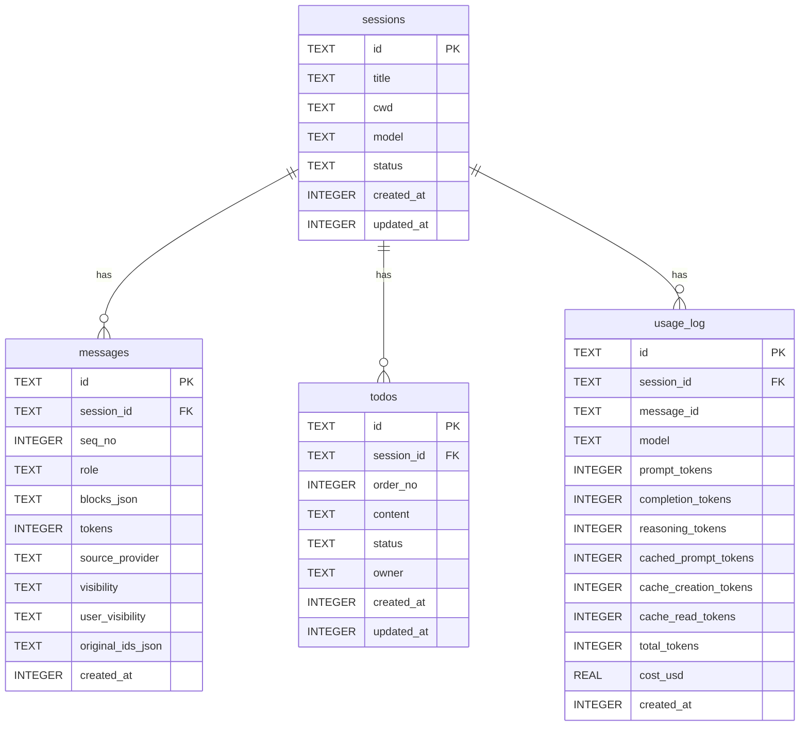

# 6. Session 存储与协议适配（R3 + R5 修订）

> Status: ✅ R3 已锁定（2026-05-24）+ R5 修订（2026-05-24）
> 范围：SQLite 表结构、迁移机制、ID 策略、事务策略、Provider Codec 双向转换、思考模式与可见性的存储约束
> 关联：本章实现 [`05-core-abstractions.md`](05-core-abstractions.md) §5.3 (`llm`) 与 §5.8 (`session`) 中定义的接口
>
> **R5 修订点**（2026-05-24，本文档已就地更新）：
> - §6.3.4 `usage_log` 表新增三列：`cached_prompt_tokens` / `cache_creation_tokens` / `cache_read_tokens`
> - §6.6.2 `usage.sql` 查询新增三列读写
> - §6.9 Codec 接口实化为正式契约（每 Provider 子包必须实现的最小集）
> - §6.9.3 Anthropic Codec 表新增 reasoning_tokens 提取算法说明
> - 详见 [`08-llm-providers.md`](08-llm-providers.md)

---

## 6.1 工具链分工

| 工具 | 职责 |
|---|---|
| `golang-migrate/migrate` v4 | 管理 DDL 演进（建表 / 加列 / 加索引），版本化 |
| `sqlc` v1+ | 把 SELECT/INSERT/UPDATE 等 SQL 编译成类型安全 Go 代码 |
| `modernc.org/sqlite` | 纯 Go SQLite 驱动（无 cgo 依赖）|
| `github.com/google/uuid` v1.6+ | 生成 UUIDv7（time-ordered UUID） |

边界：migrate 写 DDL，sqlc 写 DML，两者对同一 schema 视图保持一致。

---

## 6.2 文件位置

```
internal/session/
├── session.go                    # 域模型（见 §5.8）
└── store/
    ├── store.go                  # Repository 实现：包装 sqlc 生成代码 + 业务逻辑
    ├── db.go                     # *sql.DB 创建、迁移驱动、嵌入文件
    ├── codec.go                  # llm.ContentBlock ↔ blocks_json 序列化
    ├── queries/                  # sqlc 输入的查询 SQL
    │   ├── sessions.sql
    │   ├── messages.sql
    │   ├── todos.sql
    │   └── usage.sql
    └── gen/                      # sqlc 生成的代码（提交到 git）
        ├── db.go
        ├── models.go
        ├── sessions.sql.go
        ├── messages.sql.go
        ├── todos.sql.go
        └── usage.sql.go

internal/session/migrations/      # SQL 迁移文件（go:embed 进二进制）
├── 0001_init.up.sql
├── 0001_init.down.sql
└── ...
```

> 注：`migrations/` 直接放在 `internal/session/` 下而不是 `internal/session/store/`，因为它是整个 session 模块的资产，不属于 store 实现细节。

---

## 6.3 表结构

总览：

| 表 | 作用 | 主要操作 |
|---|---|---|
| `sessions` | 会话元信息 | INSERT / SELECT / UPDATE |
| `messages` | 对话消息（含可见性两维） | append-only INSERT；压缩用 UPDATE visibility |
| `todos` | Todo 列表 | write_plan 时整体 REPLACE |
| `usage_log` | 每次 LLM 请求的 token / 费用 | append-only INSERT |
| `schema_migrations` | golang-migrate 自动管理 | — |

不引入 `traces` 表（Trace 走日志文件，详见 R12）。

### 6.3.1 `sessions`

```sql
CREATE TABLE sessions (
    id           TEXT    PRIMARY KEY,                     -- UUIDv7
    title        TEXT    NOT NULL DEFAULT '',
    cwd          TEXT    NOT NULL DEFAULT '',
    model        TEXT    NOT NULL DEFAULT '',             -- 创建时激活的模型名
    status       TEXT    NOT NULL DEFAULT 'active',       -- active | ended | abandoned
    created_at   INTEGER NOT NULL,                        -- unix milli
    updated_at   INTEGER NOT NULL                         -- unix milli
);
CREATE INDEX idx_sessions_updated_at ON sessions(updated_at DESC);
```

注：`UsageTotal` 字段不在表上累加，由 `GetSession` 通过对 `usage_log` 的聚合查询填充（见 §6.6）。

### 6.3.2 `messages`

```sql
CREATE TABLE messages (
    id              TEXT    PRIMARY KEY,                  -- UUIDv7
    session_id      TEXT    NOT NULL REFERENCES sessions(id) ON DELETE CASCADE,
    seq_no          INTEGER NOT NULL,                     -- 在 session 内的单调序号
    role            TEXT    NOT NULL,                     -- system | user | assistant | tool

    -- 内容（Canonical 表达）
    blocks_json     TEXT    NOT NULL DEFAULT '[]',        -- []llm.ContentBlock 的 JSON

    -- 元数据
    tokens            INTEGER NOT NULL DEFAULT 0,
    source_provider   TEXT    NOT NULL DEFAULT '',        -- openai | anthropic | gemini | ''(用户)
    visibility        TEXT    NOT NULL DEFAULT 'live',    -- LLM 可见性：live | archived | summary
    user_visibility   TEXT    NOT NULL DEFAULT 'visible', -- 用户可见性：visible | hidden | system
    original_ids_json TEXT    NOT NULL DEFAULT '[]',      -- summary 关联的被归档 ids
    created_at        INTEGER NOT NULL
);

-- 序号唯一
CREATE UNIQUE INDEX idx_messages_session_seq ON messages(session_id, seq_no);

-- ListLiveMessages 主索引（visibility ∈ {live, summary} 过滤）
CREATE INDEX idx_messages_session_visibility ON messages(session_id, visibility, seq_no);

-- ListVisibleMessages 主索引（user_visibility=visible AND visibility ≠ archived）
CREATE INDEX idx_messages_session_user_vis ON messages(session_id, user_visibility, seq_no);
```

### 6.3.3 `todos`

```sql
CREATE TABLE todos (
    id           TEXT    PRIMARY KEY,                     -- UUIDv7
    session_id   TEXT    NOT NULL REFERENCES sessions(id) ON DELETE CASCADE,
    order_no     INTEGER NOT NULL,                        -- 显示顺序（"order" 是 SQL 关键字）
    content      TEXT    NOT NULL,
    status       TEXT    NOT NULL DEFAULT 'pending',      -- pending | in_progress | completed | cancelled
    owner        TEXT    NOT NULL DEFAULT 'main',         -- main | sub
    created_at   INTEGER NOT NULL,
    updated_at   INTEGER NOT NULL
);
CREATE INDEX idx_todos_session ON todos(session_id, order_no);
```

### 6.3.4 `usage_log`

```sql
CREATE TABLE usage_log (
    id                    TEXT    PRIMARY KEY,                -- UUIDv7
    session_id            TEXT    NOT NULL REFERENCES sessions(id) ON DELETE CASCADE,
    message_id            TEXT,                               -- 关联的 assistant 消息（可空）
    model                 TEXT    NOT NULL,
    prompt_tokens         INTEGER NOT NULL DEFAULT 0,
    completion_tokens     INTEGER NOT NULL DEFAULT 0,
    reasoning_tokens      INTEGER NOT NULL DEFAULT 0,         -- R3 新增：思考 tokens
    cached_prompt_tokens  INTEGER NOT NULL DEFAULT 0,         -- R5 新增：OpenAI cached_input / Gemini cachedContent
    cache_creation_tokens INTEGER NOT NULL DEFAULT 0,         -- R5 新增：Anthropic cache_creation
    cache_read_tokens     INTEGER NOT NULL DEFAULT 0,         -- R5 新增：Anthropic cache_read
    total_tokens          INTEGER NOT NULL DEFAULT 0,
    cost_usd              REAL    NOT NULL DEFAULT 0,
    created_at            INTEGER NOT NULL
);
CREATE INDEX idx_usage_session_time ON usage_log(session_id, created_at);
CREATE INDEX idx_usage_global_time ON usage_log(created_at);
```

> **迁移文件**：上述三个 cache 字段以 `0002_add_usage_cache_columns.up.sql` / `.down.sql` 单独追加（不修改 0001_init.up.sql）。

### 6.3.5 ER 图



---

## 6.4 ID 策略

**决定**：所有主键使用 **UUIDv7**（time-ordered UUID）。

理由：

| 维度 | 选择 | 说明 |
|---|---|---|
| 排序性 | 单调递增 | 索引友好；无需 `ORDER BY created_at` 也能近似时间排序 |
| 唯一性 | 全局唯一 | 多进程 / 多实例并发安全 |
| 表达 | TEXT（36 字符标准 UUID 表达） | 便于阅读与调试；性能足够 |
| 库 | `github.com/google/uuid` v1.6+ | Google 官方，1.6 引入了 NewV7 |

替代方案 `nanoid` 不有序，`auto-increment` 跨实例困难，`ULID` 与 v7 等价但社区采用度更低，故选 v7。

---

## 6.5 迁移机制

### 6.5.1 文件命名

```
{4 位序号}_{snake_case 描述}.{up|down}.sql
```

例：

```
0001_init.up.sql
0001_init.down.sql
0002_add_messages_user_visibility_index.up.sql
0002_add_messages_user_visibility_index.down.sql
```

### 6.5.2 嵌入二进制

```go
// internal/session/store/db.go
package store

import (
    "database/sql"
    "embed"
    "errors"

    "github.com/golang-migrate/migrate/v4"
    sqlitedrv "github.com/golang-migrate/migrate/v4/database/sqlite"
    "github.com/golang-migrate/migrate/v4/source/iofs"
    _ "modernc.org/sqlite"
)

//go:embed ../migrations/*.sql
var migrationsFS embed.FS

// OpenAndMigrate 打开数据库、应用迁移、设置 PRAGMA
func OpenAndMigrate(dsn string) (*sql.DB, error) {
    db, err := sql.Open("sqlite", dsn)
    if err != nil { return nil, err }

    // 启用外键 + WAL + busy_timeout
    if _, err := db.Exec(`
        PRAGMA foreign_keys = ON;
        PRAGMA journal_mode = WAL;
        PRAGMA busy_timeout = 5000;
    `); err != nil {
        return nil, err
    }

    src, err := iofs.New(migrationsFS, "migrations")
    if err != nil { return nil, err }
    drv, err := sqlitedrv.WithInstance(db, &sqlitedrv.Config{})
    if err != nil { return nil, err }
    m, err := migrate.NewWithInstance("iofs", src, "sqlite", drv)
    if err != nil { return nil, err }

    if err := m.Up(); err != nil && !errors.Is(err, migrate.ErrNoChange) {
        return nil, err
    }
    return db, nil
}
```

### 6.5.3 触发时机

| 时机 | 行为 |
|---|---|
| 进程启动（任何子命令） | 自动执行 `migrate.Up()` |
| `mini-agent migrate` 子命令 | 显式触发；额外打印执行的迁移文件 |
| 启动失败 | 进程退出并报错 |

### 6.5.4 默认路径与 PRAGMA

| 配置 | 默认值 |
|---|---|
| 数据库文件 | `~/.mini-agent/data.db` |
| 配置项（viper） | `storage.database_path`（具体字段名 R4 详定） |
| `journal_mode` | `WAL` |
| `foreign_keys` | `ON` |
| `busy_timeout` | `5000` |

---

## 6.6 sqlc 配置

### 6.6.1 `sqlc.yaml`

```yaml
version: "2"
sql:
  - engine: "sqlite"
    schema: "internal/session/migrations"
    queries: "internal/session/store/queries"
    gen:
      go:
        package: "gen"
        out: "internal/session/store/gen"
        sql_package: "database/sql"
        emit_interface: false
        emit_json_tags: false
        emit_pointers_for_null_types: true
```

### 6.6.2 查询文件示例

**`queries/sessions.sql`**

```sql
-- name: CreateSession :one
INSERT INTO sessions (id, title, cwd, model, status, created_at, updated_at)
VALUES (?, ?, ?, ?, ?, ?, ?)
RETURNING *;

-- name: GetSession :one
SELECT * FROM sessions WHERE id = ?;

-- name: ListSessions :many
SELECT * FROM sessions
ORDER BY updated_at DESC
LIMIT ? OFFSET ?;

-- name: UpdateSession :exec
UPDATE sessions SET title = ?, status = ?, updated_at = ? WHERE id = ?;

-- name: DeleteSession :exec
DELETE FROM sessions WHERE id = ?;
```

**`queries/messages.sql`**

```sql
-- name: AppendMessage :one
INSERT INTO messages (
    id, session_id, seq_no, role, blocks_json,
    tokens, source_provider, visibility, user_visibility,
    original_ids_json, created_at
) VALUES (?, ?, ?, ?, ?, ?, ?, ?, ?, ?, ?)
RETURNING *;

-- name: NextSeqNo :one
SELECT COALESCE(MAX(seq_no), 0) + 1 FROM messages WHERE session_id = ?;

-- name: ListLiveMessages :many
-- 给 LLM：visibility ∈ {live, summary}（user_visibility 不参与过滤）
SELECT * FROM messages
WHERE session_id = ?
  AND visibility IN ('live', 'summary')
ORDER BY seq_no;

-- name: ListVisibleMessages :many
-- 给 UI 默认渲染：user_visibility=visible 且 visibility ≠ archived
SELECT * FROM messages
WHERE session_id = ?
  AND user_visibility = 'visible'
  AND visibility != 'archived'
ORDER BY seq_no;

-- name: ListAllMessages :many
SELECT * FROM messages
WHERE session_id = ?
ORDER BY seq_no;

-- name: MarkMessagesArchived :exec
-- 压缩：把 list 中的 message id 改为 archived
UPDATE messages
SET visibility = 'archived'
WHERE id IN (sqlc.slice('ids'));
```

**`queries/todos.sql`**

```sql
-- name: ListTodos :many
SELECT * FROM todos WHERE session_id = ? ORDER BY order_no;

-- name: DeleteTodosBySession :exec
DELETE FROM todos WHERE session_id = ?;

-- name: InsertTodo :exec
INSERT INTO todos (id, session_id, order_no, content, status, owner, created_at, updated_at)
VALUES (?, ?, ?, ?, ?, ?, ?, ?);
```

**`queries/usage.sql`**

```sql
-- name: AddUsage :exec
INSERT INTO usage_log (
    id, session_id, message_id, model,
    prompt_tokens, completion_tokens, reasoning_tokens,
    cached_prompt_tokens, cache_creation_tokens, cache_read_tokens,
    total_tokens, cost_usd, created_at
) VALUES (?, ?, ?, ?, ?, ?, ?, ?, ?, ?, ?, ?, ?);

-- name: SessionUsage :one
SELECT
    COALESCE(SUM(prompt_tokens), 0)         AS prompt_tokens,
    COALESCE(SUM(completion_tokens), 0)     AS completion_tokens,
    COALESCE(SUM(reasoning_tokens), 0)      AS reasoning_tokens,
    COALESCE(SUM(cached_prompt_tokens), 0)  AS cached_prompt_tokens,
    COALESCE(SUM(cache_creation_tokens), 0) AS cache_creation_tokens,
    COALESCE(SUM(cache_read_tokens), 0)     AS cache_read_tokens,
    COALESCE(SUM(total_tokens), 0)          AS total_tokens,
    COALESCE(SUM(cost_usd), 0)              AS cost_usd,
    COUNT(*)                                AS requests
FROM usage_log
WHERE session_id = ?;

-- name: GlobalUsage :one
SELECT
    COALESCE(SUM(prompt_tokens), 0)         AS prompt_tokens,
    COALESCE(SUM(completion_tokens), 0)     AS completion_tokens,
    COALESCE(SUM(reasoning_tokens), 0)      AS reasoning_tokens,
    COALESCE(SUM(cached_prompt_tokens), 0)  AS cached_prompt_tokens,
    COALESCE(SUM(cache_creation_tokens), 0) AS cache_creation_tokens,
    COALESCE(SUM(cache_read_tokens), 0)     AS cache_read_tokens,
    COALESCE(SUM(total_tokens), 0)          AS total_tokens,
    COALESCE(SUM(cost_usd), 0)              AS cost_usd,
    COUNT(*)                                AS requests
FROM usage_log;
```

---

## 6.7 Repository 实现

### 6.7.1 类型与构造

```go
// internal/session/store/store.go
type Store struct {
    db *sql.DB
    q  *gen.Queries
}

func New(db *sql.DB) *Store {
    return &Store{db: db, q: gen.New(db)}
}
```

### 6.7.2 `AppendMessage`（高频，无事务）

```go
func (s *Store) AppendMessage(ctx context.Context, m session.Message) (session.Message, error) {
    if m.ID == "" {
        v7, err := uuid.NewV7()
        if err != nil { return session.Message{}, err }
        m.ID = v7.String()
    }
    if m.SeqNo == 0 {
        next, err := s.q.NextSeqNo(ctx, m.SessionID)
        if err != nil { return session.Message{}, err }
        m.SeqNo = int(next)
    }
    if m.CreatedAt.IsZero() { m.CreatedAt = time.Now() }
    if m.Visibility == "" { m.Visibility = session.VisibilityLive }
    if m.UserVisibility == "" { m.UserVisibility = session.UserVisible }

    blocksJSON, err := json.Marshal(m.Blocks)
    if err != nil { return session.Message{}, err }

    raw, err := s.q.AppendMessage(ctx, gen.AppendMessageParams{
        ID:              m.ID,
        SessionID:       m.SessionID,
        SeqNo:           int64(m.SeqNo),
        Role:            string(m.Role),
        BlocksJson:      string(blocksJSON),
        Tokens:          int64(m.Tokens),
        SourceProvider:  m.SourceProvider,
        Visibility:      string(m.Visibility),
        UserVisibility:  string(m.UserVisibility),
        OriginalIdsJson: marshalIDs(m.OriginalIDs),
        CreatedAt:       m.CreatedAt.UnixMilli(),
    })
    if err != nil { return session.Message{}, err }
    return toDomainMessage(raw), nil
}
```

### 6.7.3 `ApplyCompaction`（事务）

```go
func (s *Store) ApplyCompaction(
    ctx context.Context,
    sessionID string,
    archiveIDs []string,
    summaries []session.Message,
) error {
    tx, err := s.db.BeginTx(ctx, nil)
    if err != nil { return err }
    defer tx.Rollback()
    qtx := s.q.WithTx(tx)

    // 1. 把要归档的消息 visibility 改为 archived
    if len(archiveIDs) > 0 {
        if err := qtx.MarkMessagesArchived(ctx, archiveIDs); err != nil {
            return err
        }
    }

    // 2. 插入新的 summary 消息
    for _, m := range summaries {
        m.Visibility = session.VisibilitySummary  // 强制设为 summary
        if m.ID == "" { m.ID = uuid.Must(uuid.NewV7()).String() }
        if m.SeqNo == 0 {
            next, err := qtx.NextSeqNo(ctx, sessionID)
            if err != nil { return err }
            m.SeqNo = int(next)
        }
        if _, err := qtx.AppendMessage(ctx, /* params ... */); err != nil {
            return err
        }
    }
    return tx.Commit()
}
```

### 6.7.4 `ReplaceTodos`（事务）

```go
func (s *Store) ReplaceTodos(ctx context.Context, sid string, todos []session.Todo) error {
    tx, err := s.db.BeginTx(ctx, nil)
    if err != nil { return err }
    defer tx.Rollback()
    qtx := s.q.WithTx(tx)

    if err := qtx.DeleteTodosBySession(ctx, sid); err != nil { return err }
    for i, t := range todos {
        if t.ID == "" { t.ID = uuid.Must(uuid.NewV7()).String() }
        t.Order = i + 1  // 强制按顺序
        if t.CreatedAt.IsZero() { t.CreatedAt = time.Now() }
        t.UpdatedAt = time.Now()
        if err := qtx.InsertTodo(ctx, /* params ... */); err != nil {
            return err
        }
    }
    return tx.Commit()
}
```

### 6.7.5 `GetSession`（含 Usage 聚合）

```go
func (s *Store) GetSession(ctx context.Context, id string) (session.Session, error) {
    raw, err := s.q.GetSession(ctx, id)
    if err != nil {
        if errors.Is(err, sql.ErrNoRows) { return session.Session{}, session.ErrNotFound }
        return session.Session{}, err
    }
    sess := toDomainSession(raw)

    // 通过聚合查询填充 UsageTotal
    usage, err := s.q.SessionUsage(ctx, id)
    if err == nil {
        sess.UsageTotal = session.Usage{
            PromptTokens:     int(usage.PromptTokens),
            CompletionTokens: int(usage.CompletionTokens),
            ReasoningTokens:  int(usage.ReasoningTokens),
            TotalTokens:      int(usage.TotalTokens),
            CostUSD:          usage.CostUsd,
            Requests:         int(usage.Requests),
        }
    }
    return sess, nil
}
```

---

## 6.8 事务策略汇总

| 操作 | 事务策略 | 理由 |
|---|---|---|
| `CreateSession` | 单条 INSERT，无事务 | 简单高频 |
| `AppendMessage` | 单条 INSERT，无事务 | 高频；性能优先 |
| `AddUsage` | 单条 INSERT，无事务 | 高频 |
| `ApplyCompaction` | **事务**（UPDATE 多条 archived + 批量 INSERT summaries） | 必须原子 |
| `ReplaceTodos` | **事务**（DELETE + 批量 INSERT） | 必须原子 |
| `GetSession` + Usage 聚合 | 只读多查询，无事务 | 读不需要原子 |
| `ListLiveMessages` / `ListVisibleMessages` / `ListAllMessages` | 只读，无事务 | 同上 |

---

## 6.9 Provider Codec（双向转换）

每个 provider 子包**自带 Codec**，负责协议层 ↔ Canonical 的双向转换。

### 6.9.1 Codec 契约（R5 实化）

每个 Provider 子包**自带 Codec**，作为该子包的私有实现细节，对外不暴露。Codec 必须实现的最小集（不要求 Go 上正式声明 interface，仅为编码契约）：

```go
// internal/llm/<provider>/codec.go（私有，仅同包使用）

// canonicalToAPIRequest 把 canonical Request 转成 SDK / API 请求体
// 包括：messages 翻译、tools schema rename、ToolChoice 映射、ThinkingEffort 映射
func canonicalToAPIRequest(req *llm.Request) *<sdk>.Request

// streamEventFromAPI 把 SDK 流式事件翻译为 canonical StreamEvent
// 必须能产出：StreamDelta / StreamFinal / StreamError / StreamBlockBoundary 四类
// 必须保留 Anthropic thinking 块的 signature 到 ContentBlock.ThinkingSignature
func streamEventFromAPI(raw <sdk>.StreamEvent) *llm.StreamEvent

// usageFromAPI 把 SDK usage 翻译为 canonical Usage（含 cache 字段）
// usage 缺失时按 §8.7.2 / §8.10 fallback；返回零值不阻断
func usageFromAPI(raw *<sdk>.Usage) llm.Usage
```

`apiToCanonicalMessage` 等子函数仅供 Codec 内部使用，不暴露给外部包。详细的协议字段映射见 [`08-llm-providers.md`](08-llm-providers.md) §8.5–§8.7。

### 6.9.2 OpenAI ↔ Canonical 转换规则

| Canonical | OpenAI |
|---|---|
| `assistant + [TextBlock("hi"), ToolUseBlock(...)]` | `{role:"assistant", content:"hi", tool_calls:[{id, type:"function", function:{name, arguments(JSON 字符串)}}]}` |
| `user + [ToolResultBlock(ref=X, output=Y)]` | `{role:"tool", tool_call_id:X, content:Y}`（独立成一条消息） |
| `system + [TextBlock("...")]` | `{role:"system", content:"..."}` |
| 流式 `delta.reasoning_content` | `Delta.Thinking` |
| 流式 `delta.content` | `Delta.Content` |
| 流式 `delta.tool_calls[i]` | `Delta.ToolCallDelta` |
| `response.usage.prompt_tokens` | `Usage.PromptTokens` |
| `response.usage.prompt_tokens_details.cached_tokens` | `Usage.CachedPromptTokens`（R5 新增） |
| `response.usage.completion_tokens` | `Usage.CompletionTokens`（已含 reasoning_tokens） |
| `response.usage.completion_tokens_details.reasoning_tokens` | `Usage.ReasoningTokens` |
| `reasoning.encrypted_content`（仅 ZDR）| `ContentBlock.ThinkingSignature`（R5：thinking 块签名同等待遇） |

### 6.9.3 Anthropic ↔ Canonical 转换规则

| Canonical | Anthropic |
|---|---|
| `system + [TextBlock(...)]` 多条 | 拼接为 request 顶层 `system` 字段（不出现在 messages 数组） |
| `assistant + [ThinkingBlock(text=T, signature=S), ToolUseBlock(id, name, input)]` | `{role:"assistant", content:[{type:"thinking", thinking:T, signature:S}, {type:"tool_use", id, name, input}]}` |
| `user + [ToolResultBlock(ref=X, output=Y, is_error=E)]` | `{role:"user", content:[{type:"tool_result", tool_use_id:X, content:Y, is_error:E}]}` |
| 流式 thinking 增量 | `Delta.Thinking` |
| 流式 text 增量 | `Delta.Content` |
| 流式 input_json_delta | `Delta.ToolCallDelta` |
| `content_block_start` / `content_block_stop` | `StreamBlockBoundary`（R5 新增） |
| `response.usage.input_tokens` | `Usage.PromptTokens` |
| `response.usage.cache_creation_input_tokens` | `Usage.CacheCreationTokens`（R5 新增）|
| `response.usage.cache_read_input_tokens` | `Usage.CacheReadTokens`（R5 新增）|
| `response.usage.output_tokens` | `Usage.CompletionTokens`（含 thinking） |
| 由 Codec 按字符比例分摊 output_tokens 提取 | `Usage.ReasoningTokens`（R5 算法见 [`08-llm-providers.md`](08-llm-providers.md) §8.7.2）|

### 6.9.4 关键约束

- **`thinking` 块的 signature 必须原样保留并回传**：Codec 解析时必须存到 `ContentBlock.ThinkingSignature`，序列化回 Anthropic 时必须原样填回；否则下一轮请求被拒
- **OpenAI `role: tool` 在 canonical 层被规范化为 `user + ToolResultBlock`**：避免 canonical 层出现"伪 tool role"
- **多个连续的 `system` 消息**在 Anthropic 转换时拼接合并；OpenAI 转换时保留为多条 system 消息
- **图片 / multipart 等扩展**：Canonical ContentBlock 留有扩展位，但 P0 阶段不实现

---

## 6.10 思考模式与可见性的存储约束

### 6.10.1 思考模式约束

来源：§5.7 R3 Pinned 增补 + §5.3 R3 ContentBlock 修订。

| 约束 | 说明 |
|---|---|
| Anthropic thinking + tool_use 不可拆开 | 同一 assistant 消息内 thinking + tool_use 块必须一起存、一起加载、一起归档 |
| `ThinkingSignature` 必须原样持久化 | 存于 `blocks_json` 中；Codec 严禁丢失 |
| 加密思考 (`redacted_thinking`) | 存为 `BlockRedactedThinking` 类型；Codec 不解密、不修改 |
| ReasoningTokens 独立计数 | 存于 `usage_log.reasoning_tokens` 字段；不与 completion_tokens 混淆 |

### 6.10.2 可见性约束

| 维度 | 约束 |
|---|---|
| Visibility 切换 | 仅 `ApplyCompaction` 可把 live → archived；不允许其他路径修改 |
| Visibility=summary 消息 | 必须有非空的 `original_ids_json` |
| UserVisibility 写入 | 由调用方在 `AppendMessage` 时显式设置；默认 `visible` |
| 消息删除 | **禁止**通过任何 Repository 方法物理删除 messages 表的行（除非 `DeleteSession` 级联） |
| Compaction 后查询 | `ListLiveMessages` 自动过滤 archived；`ListVisibleMessages` 自动过滤 hidden/system 与 archived |

---

## 6.11 视图层接入点（前向引用）

视图层（CLI / Web UI 共用的 view 模型）不在 R3 范围，但本节给出"接入点"以供 R9/R10/R11 使用。

```go
// internal/view/conversation.go（R9/R11 详定）
package view

type Conversation struct {
    SessionID string
    Items     []Item
}

type Item struct {
    Kind          ItemKind
    MessageID     string
    SeqNo         int
    Role          string
    Text          string
    ToolName      string
    Args          map[string]any
    Result        string
    Success       bool
    Duration      time.Duration
    Visibility    string  // 透传 session.Message.Visibility
    UserVisibility string // 透传 session.Message.UserVisibility
}

type ItemKind string
const (
    ItemText     ItemKind = "text"
    ItemThinking ItemKind = "thinking"
    ItemToolCall ItemKind = "tool_call"
    ItemSummary  ItemKind = "summary"
)

// BuildConversation CLI 与 Web UI 共用的纯函数
// 把 []session.Message 拆解为 []view.Item
// - 一条 assistant 消息可能拆出 ItemThinking + ItemText + ItemToolCall 多个 Item
// - 一条 tool 消息合并到对应 ItemToolCall 的 Result 字段
func BuildConversation(messages []session.Message) Conversation
```

CLI 与 Web UI 各自的渲染策略详见 R9 与 R11。

---

## 6.12 关键决定（D11–D24）

| 编号 | 决定 |
|---|---|
| **D11** | 表结构：`sessions / messages / todos / usage_log` 四张业务表 + `schema_migrations`；不引入 traces 表 |
| **D12** | UUIDv7 作为所有主键；TEXT 列存储；用 `github.com/google/uuid` v1.6+ |
| **D13** | usage 单独走 `usage_log` 表，每次 LLM 响应记一条；统计通过 SUM 聚合，`Session.UsageTotal` 是视图字段 |
| **D14** | 消息内容用 Canonical ContentBlock 列表表达，存为 `blocks_json` TEXT；新增 `source_provider` 列记录来源协议 |
| **D15** | 启动时自动执行 `migrate.Up()`；提供 `mini-agent migrate` 显式触发 |
| **D16** | PRAGMA：WAL + foreign_keys=ON + busy_timeout=5000 |
| **D17** | 事务策略：高频单条 INSERT 不上事务；ApplyCompaction / ReplaceTodos 上事务；只读不上事务 |
| **D18** | 三层数据结构：Canonical `llm.Message`（含 ContentBlock）/ 存储 `session.Message`（blocks_json + visibility + user_visibility + source_provider）/ 视图 `view.Item`（按 Kind 拆解）三层各司其职 |
| **D19** | 每个 Provider 自带 Codec，负责协议层 ↔ Canonical 的双向转换；agent loop 只看到 Canonical |
| **D20** | 消息**永不物理删除**；压缩通过 `visibility` 切换实现（live → archived），并插入 `summary` 消息 |
| **D21** | `llm.ContentBlock` 新增 `Thinking` / `RedactedThinking` 类型；保留 `ThinkingSignature` 字段以兼容 Anthropic |
| **D22** | `llm.Usage` 与 `usage_log` 表新增 `ReasoningTokens` 字段；`/cost` 与 Web UI 面板单独披露 |
| **D23** | 上下文压缩对 thinking 的规则：同一 assistant 消息内 thinking + tool_use 不可拆开；Body 划分以**消息**为最小单位 |
| **D24** | 消息引入正交的两个可见性维度：`Visibility`（LLM 可见性，live/archived/summary）+ `UserVisibility`（用户可见性，visible/hidden/system）；Repository 提供 `ListLiveMessages` / `ListVisibleMessages` / `ListAllMessages` 三种查询入口 |

---

## 6.13 留待后续轮次

| 议题 | 归属 |
|---|---|
| 数据库默认路径 viper 字段名 | R4 ✅ |
| `mini-agent migrate` 子命令 CLI flag | R9 |
| ~~token 估算函数（写入 messages.tokens 字段时使用）~~ | ~~R5/R8~~ ✅ R5 已锁定（见 [`08-llm-providers.md`](08-llm-providers.md) §8.9）|
| ~~model → 单价表（计算 cost_usd）~~ | ~~R5~~ ✅ R5 已锁定（见 §8.8）|
| ~~各 provider Codec 中 thinking 协议事件名与字段位置的精确映射~~ | ~~R5~~ ✅ R5 已锁定（见 §8.7）|
| `view.Item` 的具体字段最终定稿 + BuildConversation 实现 | R9 / R11 |
| `/show-hidden` `/show-system` `/show-archived` `/thinking` 斜杠命令的精确语义 | R9 |
| Web UI hidden 调试开关、思考折叠面板的组件设计 | R11 |
| trace 中 reasoning_chunk / 思考相关事件的 Fields schema | R12 |
